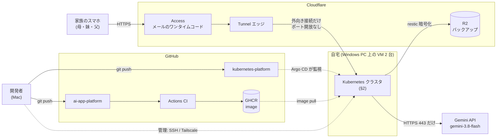
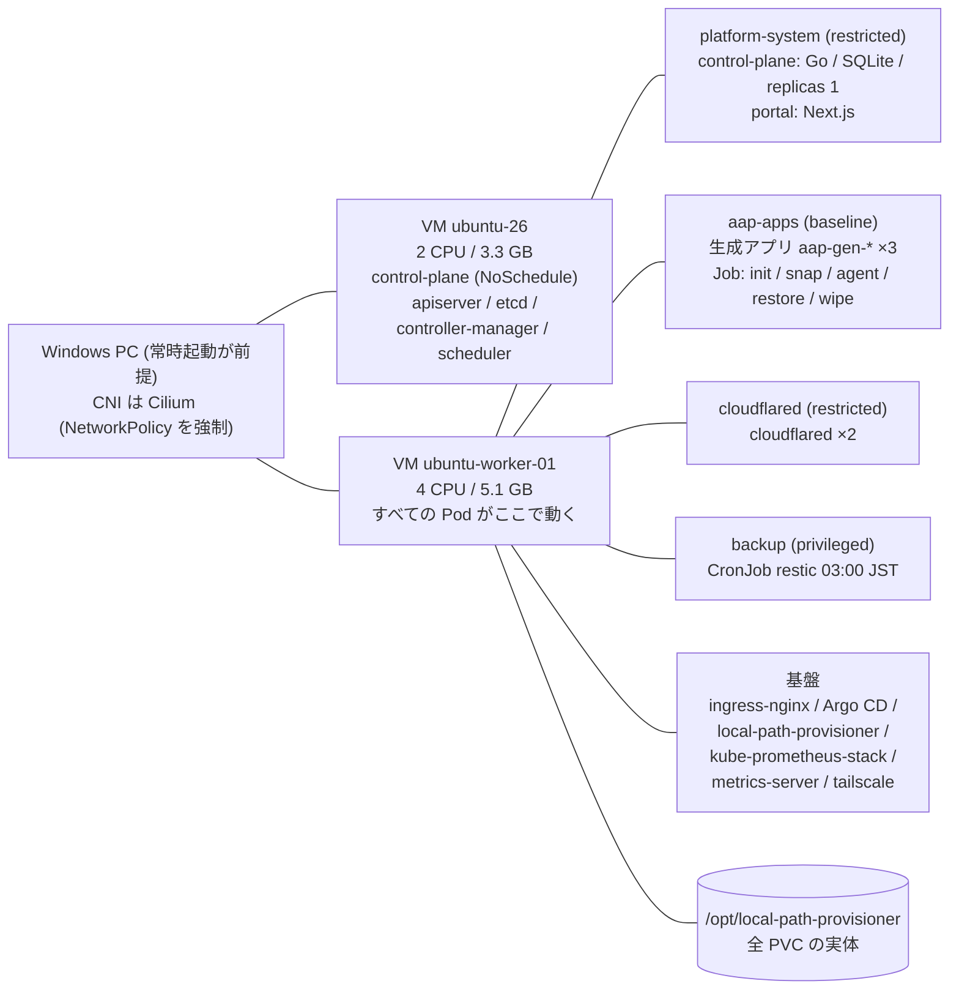
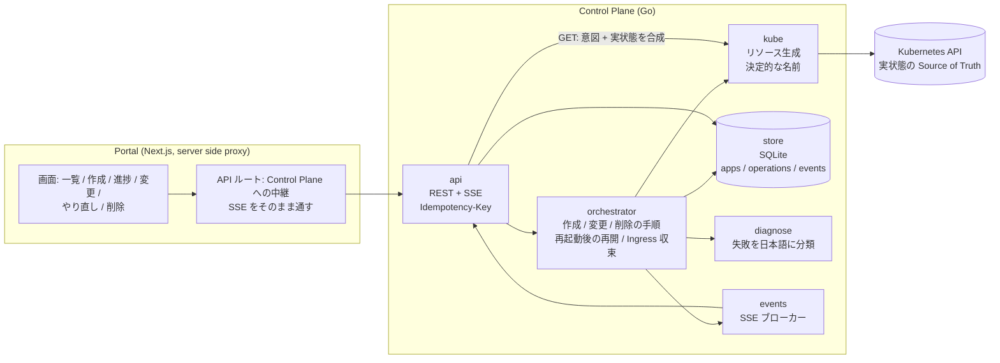
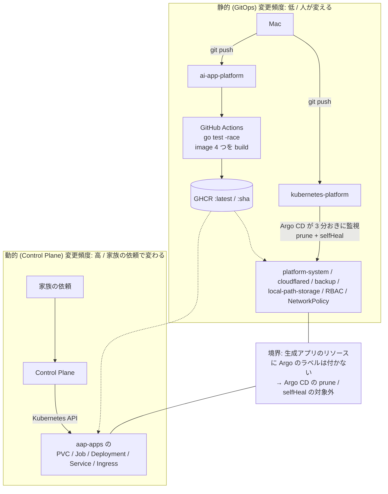
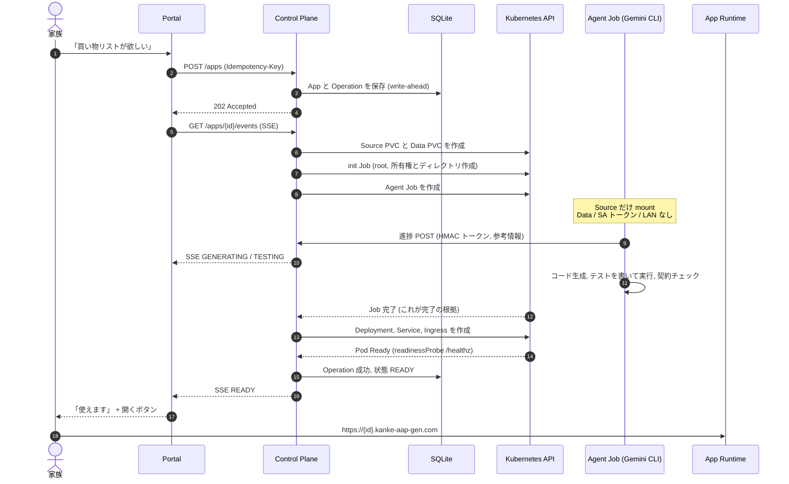
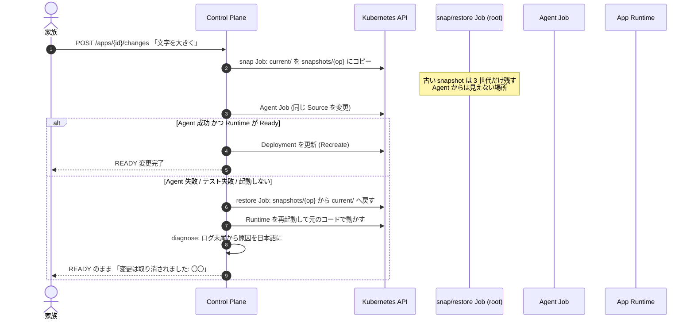
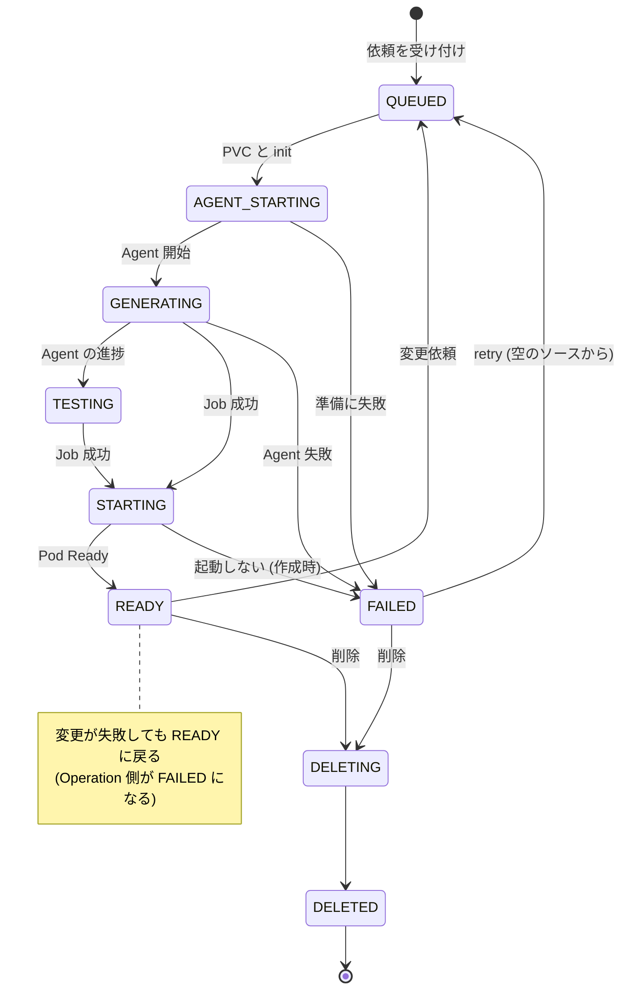
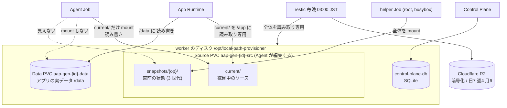
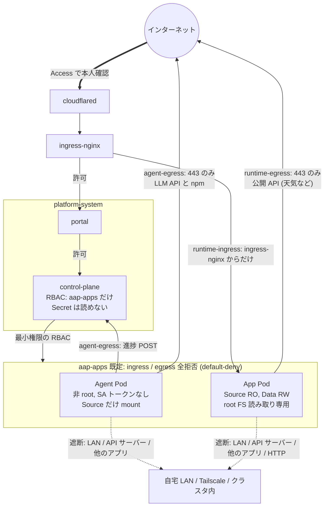
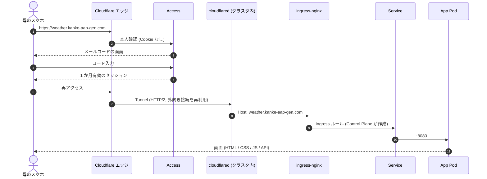

# アーキテクチャ(2026-10-05 時点の実装)

ITに詳しくない家族が、スマホから自然言語で頼むだけで、自分たち向けの小さなアプリを作り・使い・変更できる、
自宅 Kubernetes 上の Application Platform。設計の意図は [`plans/plan-2.md`](../plans/plan-2.md)、
実装中の失敗と判断は [`dev-log.md`](dev-log.md)。この文書は「**いま実際に動いているもの**」だけを書く。
未実装のものは §12 に分けてある。

- 規模: Control Plane(Go) 約 2,600 行 / Portal(Next.js) 約 370 行 / Agent・Runtime image 約 130 行。
  Go のテスト 18 件(`-race`)、実クラスタ(kind)の通しシナリオ 10 件(`hack/e2e-kind.sh`)。
- 3 リポジトリ: `ai-app-platform`(本体) / `kubernetes-platform`(クラスタの GitOps) / `aap-gen-meal`(リファレンスアプリ)。

---

## 1. システム全体(コンテキスト)

| 経路 | 手段 | 認証 |
|---|---|---|
| 家族 → Portal / 生成アプリ | Cloudflare Tunnel + Access | メールのワンタイムコード(セッション 1 か月) |
| 開発者 → クラスタ(管理) | SSH / Tailscale | 鍵 / Tailscale |
| クラスタ → 外 | Gemini API、R2、GHCR、公開 API(天気など) | API キー / Secret |

---

## 2. クラスタの構成(物理 → 論理)

- 関係: Control Plane は Kubernetes API 経由で `aap-apps` に PVC / Job / Deployment / Service / Ingress を作る。
  `local-path-provisioner` が PVC の実体を `/opt/local-path-provisioner` に作り、`backup` の CronJob はそこを hostPath で読み取り専用に見る。
- Kubernetes v1.36.4、containerd。Argo CD が管理するのは**静的な基盤**だけ(下の §4)。
- 生成アプリのリソース(`aap-gen-*`)は **Control Plane が実行時に作る**。Argo CD は追跡しないので prune されない。
- 単一ノードの障害に耐えるものではない(PVC は worker のディスク上)。バックアップが唯一の保険(§9)。

---

## 3. Platform のコンポーネントと責務

| パッケージ | 責務 | 重要な設計 |
|---|---|---|
| `api` | `/api/v1/apps`、`/changes`、`/retry`、`DELETE`、`/events`(SSE)、`/internal/.../events`(Agent 用) | `Idempotency-Key` で二重作成を防ぐ。予約語(`portal` など)は ID に使えない |
| `orchestrator` | create / modify / delete の手順を命令的に実行 | Kubernetes を呼ぶ**前に** Operation を SQLite へ保存(write-ahead)。再起動時は未完了の Operation を最初から再実行(全手順が冪等) |
| `kube` | PVC / Job / Deployment / Service / Ingress の生成 | 名前は `app-id` と `op-id` から決定的に作る → `AlreadyExists` は成功扱い |
| `store` | Platform State(意図・履歴) | WAL モード。列追加は起動時に自動マイグレーション |
| `diagnose` | Agent の失敗ログ → 家族向けの文言 | 利用上限 / キー / 時間切れ / 通信 / テスト失敗。生ログは運用者向けに別保存 |

**状態の持ち分(重要な設計判断)**

| | Source of Truth | 例 |
|---|---|---|
| Platform の意図・履歴 | Control Plane の SQLite | どのアプリがあるか、誰がどんな依頼をしたか、Operation の履歴 |
| Runtime の実状態 | Kubernetes API(キャッシュしない) | Job が完了したか、Pod が Ready か、PVC が Bound か |

アプリの詳細(`GET /apps/{id}`)は、SQLite の意図と Kubernetes の実状態を**その場で合成**して返す。

---

## 4. 配布の経路: 静的な基盤と動的なアプリを分ける

> **Static Platform Infrastructure = GitOps / Argo CD、Dynamic Application Runtime = Control Plane / Kubernetes API**
> (plan-2 §4.1)。旧案(plan.md)は「Agent → Git → Argo CD」を信頼境界にしていたが、アプリ 1 つ増やすたびに
> manifest を Git に書く重さと、Agent に manifest を書かせる危うさを避けるため、**信頼境界を Control Plane の API と RBAC に移した**。

---

## 5. アプリを作る流れ(Create)

- **完了の根拠は Job の status**。Agent の進捗 POST は表示のための参考で、完了も失敗も決められない。
- Agent の Job は使い捨て(`backoffLimit: 0`、`activeDeadline` 20 分、完了後 24 時間で自動削除)。

---

## 6. アプリを変える流れ(Modify)と、失敗したときの巻き戻し

- 失敗しても、**家族が使っているアプリは元のまま動き続ける**(実クラスタで 2 経路を検証済み:
  テストで落ちる変更 / テストは通るが起動しない変更)。
- 今の弱点: 変更中は稼働中のソースを直接書き換える。Stage 2 の「別ワークスペース → Preview → 承認」で解消予定(§12)。

---

## 7. 状態遷移

Operation は別に `PENDING → RUNNING → SUCCEEDED | FAILED` を持つ。アプリごとに同時に動く Operation は 1 つ(409 で拒否)。

---

## 8. ストレージとデータの分離

| 区分 | 性質 | 書き込める主体 |
|---|---|---|
| Source (`current/`) | 可変。Agent が編集 | Agent Job のみ |
| snapshots | 変更前の退避 | 信頼する helper Job のみ(Agent からは見えない) |
| Data | 永続。家族の実データ | App Runtime のみ。Agent と Preview には渡さない |

- 「更新後も既存のデータが壊れない」は受け入れ条件。Source と Data を別 PVC にしているのはそのため。
- 削除は既定でデータを**残す**(`purge=true` のときだけ消す)。Portal の削除は purge(確認 2 段階)。

---

## 9. ネットワークと信頼境界

| NetworkPolicy | 対象 | 許可するもの |
|---|---|---|
| `default-deny` | aap-apps の全 Pod | (何も許可しない) |
| `agent-egress` | Agent | DNS、Control Plane :8080、公開 IP への **443** |
| `runtime-ingress` | App | ingress-nginx からの :8080 だけ |
| `runtime-egress` | App | DNS、公開 IP への **443**(HTTP と LAN は不可) |
| `control-plane-ingress` | Control Plane | Agent と Portal から :8080 だけ |

Pod セキュリティ: Agent と App は `runAsNonRoot` + `drop ALL` + `seccomp: RuntimeDefault` +
`allowPrivilegeEscalation: false`。helper Job だけ `CHOWN / FOWNER / DAC_OVERRIDE` を持つ(Agent とは別の信頼しているイメージ)。

**認証の層(今は Access の 1 層)**: Portal にも Control Plane にも生成アプリにもログインはない。
外からは Cloudflare Access だけが守っている。クラスタ内は NetworkPolicy。

---

## 10. 家族のスマホから見たリクエストの経路

- QUIC(UDP)は家庭の回線で通らないので、`cloudflared` は `--protocol http2` で固定している。
- ホスト名は 1 階層(`{id}.kanke-aap-gen.com`)。2 階層は Cloudflare の無料証明書の対象外。

---

## 11. 実装中に実際に起きた問題(dev-log より) — 深掘りの材料

| # | 起きたこと | 原因 | 何を変えたか | 設計上の論点 |
|---|---|---|---|---|
| 1 | 公開設定の前に作ったアプリに Ingress がなかった | Ingress を「作成時の副作用」としてしか扱っていなかった | 5 分おきに READY のアプリを走査して足りない Ingress を作る | **望ましい状態に収束させるループ**の最初の実例(Reconciliation) |
| 2 | 天気アプリが外部 API を呼べず、**サンプル値を本物のように表示** | 既定が全拒否の egress と、生成コードの黙ったフォールバック | 公開 HTTPS だけ許可 + Agent に「サンプルを本物扱いしない」指示 | **AI 生成コードの egress をどこまで許すか**。アプリごとの許可制(AppDefinition)が自然 |
| 3 | 「直したのに直っていない」 | 生成コードが静的ファイルに 1 時間のキャッシュを付けた。CDN にもスマホにも古い版が残った | 配信ファイルの URL にバージョンを付け、Agent に no-cache を指示 | **変更が利用者に届いたこと**を誰が保証するか。見た目の不具合は Node のテストで見つからない |
| 4 | Gemini の月額上限で失敗。Portal には `BackoffLimitExceeded` だけ | 失敗を知っていても**なぜか**を伝える層がなかった。Agent は 429 を 5 分リトライ | ログ末尾を分類して日本語に + 回復不能なエラーで即停止 | 失敗を**非エンジニアが行動できる言葉**に変える層 |
| 5 | Control Plane 再起動後の続き | 命令型で、途中の失敗に弱い | write-ahead + 決定的な名前で冪等に。実クラスタで再起動を試験 | **部分失敗・再試行・再起動復旧**(Experiment B) |
| 6 | クラスタ側の `controller-manager` / `scheduler` が 300 回以上再起動 | bind-address を手で変えたが、probe は 127.0.0.1 のまま | bind-address を 0.0.0.0 に | 基盤の足元(Platform の前提が壊れていた) |
| 7 | 初回の image pull が 7 分止まった | レジストリの初回アクセスの停滞 | helper image の事前 pull | 自宅の外部依存の遅延が「作成が終わらない」に直結 |

---

## 12. まだ無いもの(正直な一覧)

| 項目 | 状態 |
|---|---|
| Stage 2: 別ワークスペース → Preview → 承認 → Build → Registry → Production | **未実装**。今は稼働中のソースを直接変更し、失敗時に snapshot から戻す |
| image と Data を 1 つの release として扱う rollback / migration | 未実装(Data のスナップショットは毎晩のバックアップのみ) |
| Reconciler(CRD / Controller) | **作っていない**。Ingress の収束ループだけが小さな実例 |
| アプリごとのネットワーク許可(AppDefinition) | 未実装。公開 HTTPS を全アプリに許可 |
| Control Plane の認証 | なし(Portal 経由と NetworkPolicy と Access に依存) |
| 失敗の自動通知、観測の統合 | Prometheus / Grafana は入っているが Platform とは未統合。バックアップ失敗の通知なし |
| Experiment A〜E(部分失敗 / 再起動 / 状態のずれ / 二重送信 / 削除失敗)の体系的な実施 | 一部(再起動・二重送信・削除)のみ。**状態のずれ(手動で Deployment を消す)は未実施** |
| Agent の隔離の検証 | Pod 単位のみ。プロンプトインジェクションの実験は未実施 |
| 実ユーザー(母)のテスト | 未実施 |
| SQLite の安全なダンプ | 稼働中のファイルをコピーしている(WAL のおかげでまれに安全だが保証はない) |

---

## 13. 技術的な深掘りの候補

評価の観点: **(a) 実装で実際に踏んだ問題があるか、(b) 検証できる実験を作れるか、(c) 30 分の枠で語れるか、(d) 聴衆の学びになるか**。

| 候補 | 実際に踏んだ問題 | 作れる実験 | 評価 |
|---|---|---|---|
| **A. 動的なアプリのライフサイクルを壊れにくくする(Reconciliation)** | #1 #5。冪等な命令型 → 収束ループへ | 部分失敗 / 再起動 / 手動削除(状態のずれ) / 二重送信 / 削除失敗の 5 実験を、命令型と収束型で比べる | plan-2 の第一候補。**素材は十分**だが実験の大半がこれから |
| **B. AI が書いたコードを動かす境界(Agent と生成アプリの隔離)** | #2 #4。egress、`yolo`、SA トークンなし、書き込み範囲 | 悪意のある / 間違った依頼で何が起きるか。egress の FQDN 制御(Cilium)、プロンプトインジェクション | **今いちばん語る価値が高い**。実装済みの層が多く、未検証の穴も具体的 |
| **C. 変更が利用者に届いたことを保証する(配布と release)** | #3。キャッシュ、見た目の不具合、承認なしの本番反映 | Stage 2(Preview + 承認 + image と Data を 1 つの release に)の導入前後比較 | 実例が強い。ただし**実装の大部分がこれから** |
| D. 失敗を非エンジニアの言葉にする(可観測性) | #4。分類 → 日本語 | 失敗の種類ごとの分類精度、母が理解できたか | 面白いが、技術の深さは A・B より浅め |

**おすすめ**: 主題は **B(隔離)** か **A(Reconciliation)**。B は「AI が生成したソフトを誰が安全に動かすか」という
このプロジェクトの問いにそのまま答え、実装済みの材料が最も多い。A は Kubernetes らしい設計判断
(命令型 → 収束)を実験で語れる。どちらも、**未実施の実験**(A: 状態のずれ / B: 悪意のある依頼)を先にやれば、
「最初の設計 → 実際に壊れた → 原因 → 設計変更 → 検証」の筋が完成する。

> **深掘りの主軸(速さ): 修正サイクルの遅延を、実測の内訳から削る**: [`deep-dive-inner-loop-latency.md`](deep-dive-inner-loop-latency.md)
>
> **深掘りの実装案(ユースケース起点)**: [`deep-dive-preview-release.md`](deep-dive-preview-release.md) —
> 「AI の成果物を何度も直したい」から Preview と Release を設計する。C を、実際に起きたユースケースから組み直したもの。

> **発表の筋(3 幕)と根拠の整理**: [`talk-story.md`](talk-story.md)

### 発表のストーリー(案)
1. 家に毎日使われる紙の表がある(母の食事予定表)
2. AI が書けるなら、家族が自分で作れるはず。でも**書いたソフトを誰が安全に動かし、直し続けるのか**
3. 自宅 Kubernetes に小さな Platform を作った(§1〜§10)
4. 実際に壊れたこと(§11)
5. 深掘り: (A または B)
6. 母は使えたか(実ユーザーの結果)
