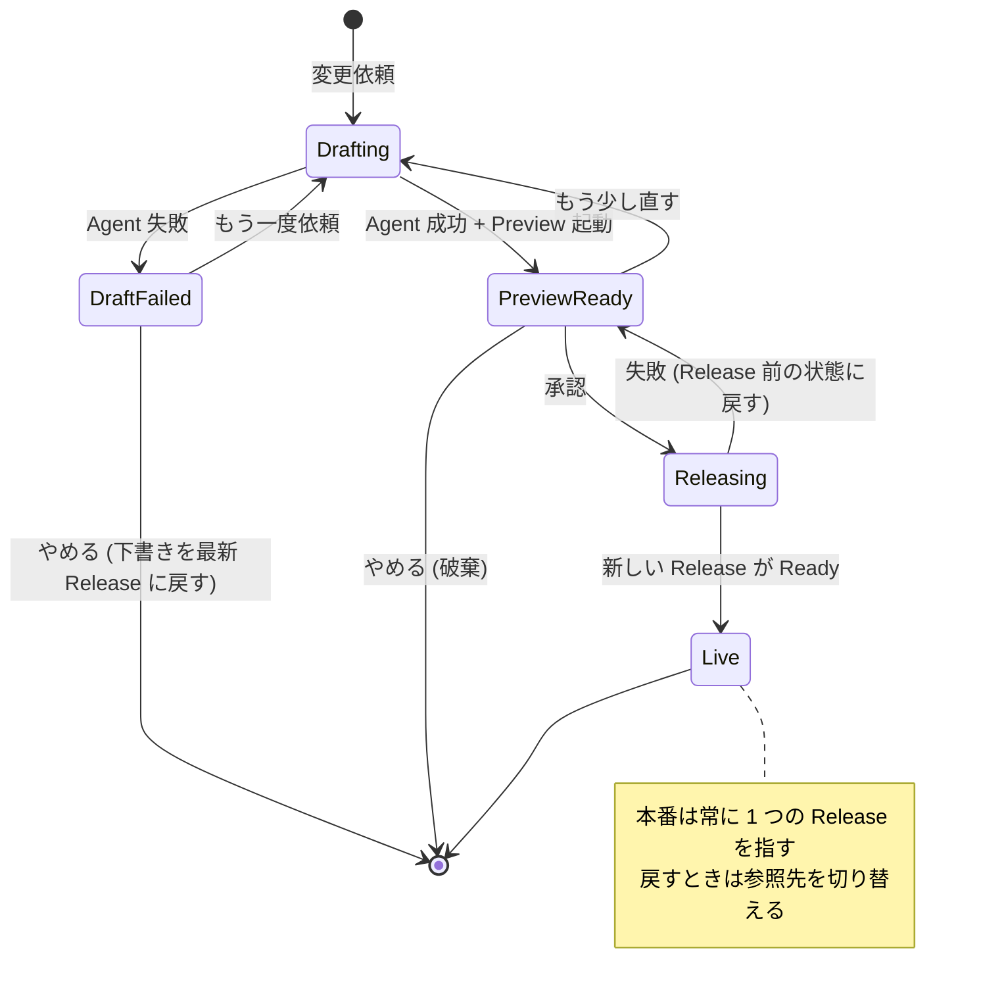
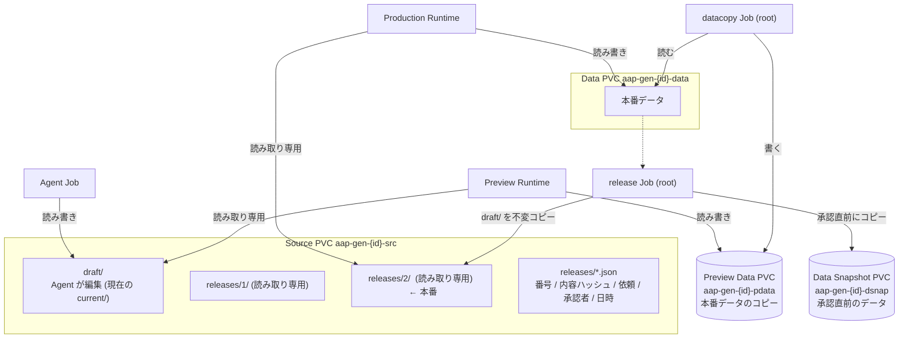
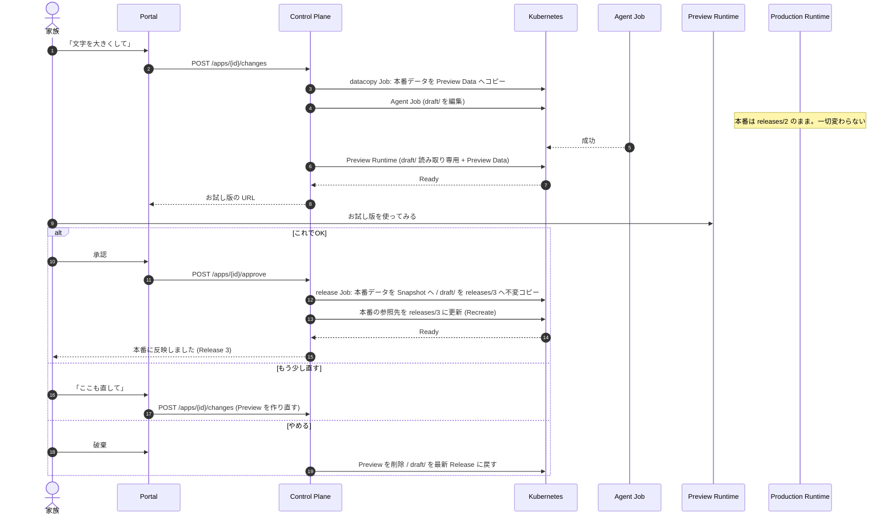

# 深掘り実装案: 「AI の成果物を何度も直したい」から、Preview と Release を設計する

CNDW 学生プロポーザルの技術的な深掘りの案。**ユースケースから出発し、インフラの設計に落とす**。
現状の構成は [`architecture.md`](architecture.md)、実装中に起きた問題は [`dev-log.md`](dev-log.md)。

> **問い**: 非エンジニアが AI に何度も直してもらうとき、「いま家族が使っているアプリ」と「直している途中のアプリ」を、
> インフラはどう分け、どう承認され、どう戻せるべきか。

---

## 1. なぜこれを深掘りするか(ユースケース → 設計)

実際に起きたことだけを根拠にする(記録は dev-log に残っている)。

| # | 実際に起きたユースケース | 困りごと | 設計 | 状態 |
|---|---|---|---|---|
| U1 | 天気アプリを**3回**直した(スピナーが消えない → キャッシュ → URL のバージョン) | 直している途中の壊れたアプリを、家族もそのまま見る。直ったかは画面を見ないと分からない | **Preview(お試し版)**: 下書きと本番を分ける | **未実装** |
| U2 | 「直したのに直っていない」 | どの版を見ているのか分からない。古い版が CDN・ブラウザに残る | **Release の同一性**: 承認した版に番号と内容ハッシュを付ける | 部分的(URL にバージョン) |
| U3 | 変更が失敗して元に戻った | データは無傷だったが、**変更でデータの形が変わっていたら**戻せない | **image + data を 1 つの release として戻す**(Data のスナップショット) | 未実装 |
| U4 | 失敗の理由が分からない / やり直したい / 消したい | 母は `kubectl` を使えない | 失敗の日本語化、retry、delete | 実装済み |
| U5 | 外の情報(天気)を使いたい | 外に出られず偽の値が出た | egress の許可(公開 HTTPS のみ) | 実装済み |

**U1〜U3 が同じ問題の別の顔**であり、これを 1 つの設計で解くのが深掘りの中身。
U4・U5 は、同じ流れで先に作ったものとして、物語の前半に置ける。

---

## 2. 用語

| 用語 | 意味 |
|---|---|
| **Draft(下書き)** | Agent が編集中のソース。家族には見せない |
| **Preview(お試し版)** | Draft を実際に動かしたもの。別の URL。**本番データのコピー**で動く |
| **Release** | 承認された、**変更できない**ソースの版。番号(1, 2, …)と内容ハッシュを持つ |
| **Production(本番)** | 特定の Release を読み取り専用で動かしている実行環境。家族が使う |
| **Data** | 家族の実データ。Production だけが書き込める |

---

## 3. 設計の全体像

### 3.1 状態

- **本番は、承認されるまで一切変わらない。** Agent が触るのは Draft だけ。
- アプリを**最初に作るとき**は承認なしで Release 1 にする(守るべき既存データも利用者もいないため)。
  変更からは必ずプレビューを経る。

### 3.2 ストレージ(volume 案)

| 領域 | 書き込める主体 | 補足 |
|---|---|---|
| `draft/` | Agent Job | これまでの `current/` |
| `releases/<n>/` | release Job(信頼するもの)のみ。作成後は読み取り専用 | 書き込み不可にして内容ハッシュを記録する |
| Production の Data | Production Runtime のみ | Agent・Preview には渡さない(既存の方針) |
| Preview Data | Preview Runtime | **捨てる前提**。承認しても本番には反映しない |
| Data Snapshot | release Job のみ | 承認直前の本番データ。戻すときに使う |

### 3.3 変更 → お試し → 承認

### 3.4 戻す(Rollback)

- **ソースだけ戻す**: 本番の参照先を `releases/<n-1>` に更新する。コピーも build もないので速い。
- **ソースとデータを戻す**: 承認時に取った Data Snapshot から Data を復元し、同時に参照先を戻す。
  変更でデータの形が変わっていても、**release 単位で整合した状態に戻れる**。
- 1 件の Release は `{番号, 内容ハッシュ, Data Snapshot の ID, 依頼, 承認者, 日時}` で 1 組。

---

## 4. 2 つの案を作って比べる(深掘りの核)

| | **A. volume 案**(本命) | **B. image 案**(plan-2 の Stage 2) |
|---|---|---|
| Release の実体 | `releases/<n>/`(不変のディレクトリ) | レジストリの image(ダイジェスト) |
| 承認時にすること | `cp -a` + 読み取り専用 + ハッシュ記録 | rootless BuildKit で build → push |
| 必要なコンポーネント | なし(helper Job だけ) | レジストリ(GHCR か in-cluster) + BuildKit + 標準 Dockerfile |
| Rollback | Deployment の参照先を切り替える | image のダイジェストを切り替える |
| 再現性 | 弱い(実行する基盤の image の更新に依存) | 強い(依存も OS も固定) |
| ディスク | `node_modules` ごとコピー。世代を制限する(例: 直近 5 世代) | レイヤーの共有で小さい |
| 自宅サーバーとの相性 | 軽い。**worker は 5 GB** | build のメモリと時間が重い |
| 失敗モード | ディスクフル、コピーの途中失敗 | build 失敗、レジストリの外部依存 |

**仮説**: 家庭の規模では A のほうが「運用の複雑さ」と「戻す速さ」で優り、B は「再現性」で優る。
**測って確かめる**(§7)。B は同じ App Contract で動く最小のプロトタイプ(spike)を作り、同じ実験にかける。

---

## 5. 変更が入る箇所(現在のコードに対して)

| 場所 | 変更 |
|---|---|
| `control-plane/internal/store` | `releases` テーブル(app_id, n, source_hash, data_snapshot, prompt, approved_by, created_at)。apps に `live_release`、draft の状態。列追加は既存のマイグレーション方式に倣う |
| `control-plane/internal/kube` | `EnsureRuntime` に Release 番号を渡す(subPath を `releases/<n>` に)。`EnsurePreview`、helper の役割 `datacopy` / `release` / `dsnap-restore` を追加。PVC `-pdata` と `-dsnap`。Preview 用 Ingress(`{id}-preview.<ドメイン>`) |
| `control-plane/internal/orchestrator` | `runBuild` を分割: `runDraft`(Agent + Preview)/ `runApprove`(Release)/ `runRollback`。**各手順を冪等に**(`releases/<n>.tmp` に作ってから rename、名前は決定的) |
| `control-plane/internal/api` | `POST /apps/{id}/approve`、`/discard`、`/rollback`、`GET /apps/{id}/releases`。`/changes` の意味が「本番を変える」から「下書きを作る」に変わる(互換性に注意) |
| `portal` | 変更後の画面: 「お試し版を開く / これでOK / もう少し直す / やめる」。「前の版に戻す」の一覧。承認者は Access のヘッダー(`Cf-Access-Authenticated-User-Email`)から記録 |
| `kubernetes-platform` | NetworkPolicy に `role=preview` を追加(runtime と同じ egress / ingress)。Access のワイルドカードは既存の `*.kanke-aap-gen.com` でカバー済み。予約語に `*-preview` を追加 |
| `hack/e2e-kind.sh` | シナリオを追加(§7 の実験の自動化) |

---

## 6. 設計判断とその理由

| 判断 | 理由 |
|---|---|
| 最初の作成だけ承認なしで Release 1 | 守るべきデータも利用者もまだいない。母に「承認」を最初から押させない |
| Preview は**本番データのコピー**で動く | 空のデータでは「いつもの表で見える」を確認できない。直接 mount すると、試した入力が本番を汚す |
| Preview の書き込みは捨てる | 承認で本番に混ぜない。混ぜるとデータの形の違いを持ち込む |
| 本番の参照先は Deployment の subPath で明示 | シンボリックリンクは subPath 経由で安全に扱えない。参照先がクラスタ上の宣言として残る |
| Release は不変にしてハッシュを記録 | 「どの版を見ているのか」(U2)に答える。ロールバックの対象が曖昧にならない |
| 承認と Release を**状態機械**にする | 途中で落ちても続きから収束できる(§7 の E6)。plan-2 の Reconciliation の話につながる |
| 世代は制限(直近 N) | worker のディスクは有限。古い Release は削除する |

---

## 7. 実験計画(「最初の設計 → 壊れた → 設計変更 → 検証」を作る)

| # | 実験 | やり方 | 測るもの | 期待 |
|---|---|---|---|---|
| E1 | **壊れた状態を家族が見る回数** | 天気アプリの実際の 3 回の修正を台本にして、Stage 1(現状)と新設計で再生。本番 URL を 2 秒おきに監視 | 壊れた応答(非 200 / 古い・壊れた画面)の回数と時間 | 新設計は 0 |
| E2 | **反映の同一性** | 承認後、本番が返す版(ハッシュ)と Release の一致を確認。ブラウザ・CDN の古い版が残る時間 | 古い版が見えた時間 | 0(Release 番号を応答に付ける) |
| E3 | **ロールバック** | (a) ソースだけ (b) データの形を変える変更のあとに戻す。データのハッシュを比べる | 戻す時間、データの無傷さ | (b) はデータも戻る |
| E4 | **volume 案 と image 案** | 同じアプリで承認を 10 回。時間、ディスク、メモリ、ロールバックの時間、コンポーネント数を比べる | 承認に要する時間 / ディスクの増え方 / 戻す時間 | A は速くて軽い、B は再現性 |
| E5 | **Preview の隔離** | Preview から本番 Data への書き込み、本番 Service への通信、Agent から releases の書き込みを試みる | すべて失敗すること | 全て遮断 |
| E6 | **承認の途中障害** | 承認の各手順の間で Control Plane を kill / helper Job を失敗させる | 再開後に同じハッシュの同じ Release に収束するか。中途半端な Release が残るか | 収束する |
| E7 | **実ユーザー** | 母に実際に使ってもらい、「お試し版」を理解できるか、承認までの回数を記録 | 修正の回数 / 迷った箇所 / 承認の理解 | 記録そのものが成果 |

E1・E3・E6 が、発表の山場になる。**いまの設計(Stage 1)で E1 を先に測っておく**と、「導入前」の数字が手に入る。

---

## 8. マイルストーン

| M | 内容 | 完了の条件 |
|---|---|---|
| M0 | **Stage 1 の E1 の測定**(導入前の数字) | 天気アプリの台本で、壊れた応答の回数と時間が出ている |
| M1 | データモデル + 本番を `releases/1` に固定(Preview なし)。作成が Release 1 を作る | 既存のテストが通り、本番が release のディレクトリで動く |
| M2 | Preview の実行(別 URL、データのコピー) + NetworkPolicy | E5 が通る |
| M3 | approve / discard / rollback の API + Portal の画面 | e2e で、お試し → 承認 → 反映 → ロールバックが通る |
| M4 | E1〜E3、E6 の実施と dev-log | 数字と失敗の記録がある |
| M5 | image 案の spike + E4 | A と B の比較表が実測で埋まる |
| M6 | 母による実テスト(E7) | 記録がある |

---

## 9. リスクと未決事項

| 項目 | 内容 | 方針 |
|---|---|---|
| ディスク | `node_modules` ごとの Release が増える | 直近 N 世代で削除。使用量を測る(E4) |
| メモリ | Preview の分だけ Pod が増える。worker は 5 GB | Preview は 1 アプリにつき 1 つ、一定時間の無操作で停止。上限を決める |
| Data コピーの時間 | 大きいデータだとプレビューまで遅い | 現状のデータは小さい。上限を超える場合の方針は未決 |
| 「お試し版」であることの表示 | 生成アプリに印を埋め込めない | Portal の画面で明示。ホスト名に `-preview` を含める |
| 承認者 | Access のメールを記録するが、誰でも承認できる | 当面は家族全員。権限は未決 |
| データの形が変わる変更 | 本番に反映した直後は Snapshot でしか戻せない | Data Snapshot を必須にする。マイグレーションの方針(後方互換を基本)を App Contract に書く |
| `/changes` の意味の変更 | 既存のクライアントの動作が変わる | Portal 以外のクライアントはまだ無い |
| 再現性(volume 案) | 実行基盤 image の更新で挙動が変わりうる | 基盤 image のダイジェストを Release に記録する案を検討 |

---

## 10. 発表での筋(案)

1. 母の紙の表 → アプリになる(ここまでの Platform)
2. **実際に触ると、何度も直したくなった**(天気アプリで 3 回。U1)
3. そのたびに本番が壊れ、直ったかも分からなかった(U2。E1 の「導入前」の数字)
4. 設計: 下書きと本番を分ける / 承認で不変の Release にする / データは別に保つ(§3)
5. **2 つの作り方を比べた**(volume と image。E4)
6. 途中で落ちても収束する(E6) / 戻せる(E3)
7. 母は使えたか(E7)

> 結論の候補: 「AI に任せるほど、**人が確認して承認する地点**をインフラが作る必要がある。
> それは Kubernetes の既存の部品(Job、PVC、Deployment、NetworkPolicy)の組み合わせで、小さく実現できる」
