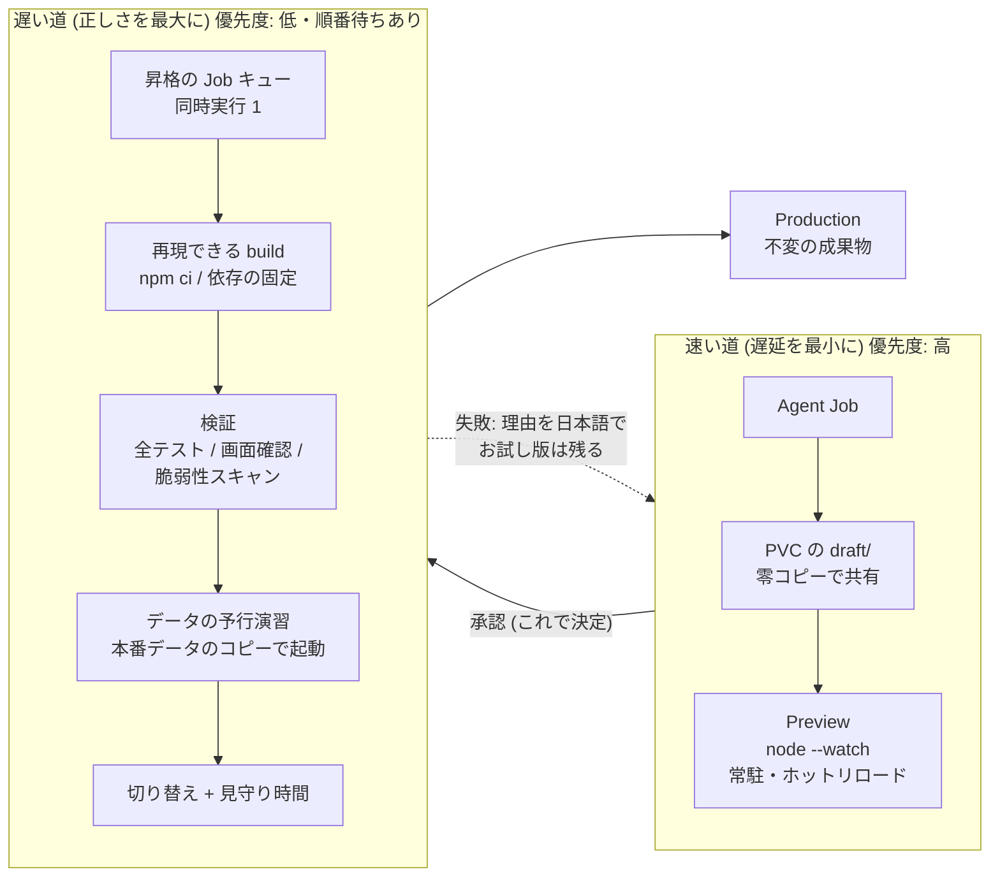
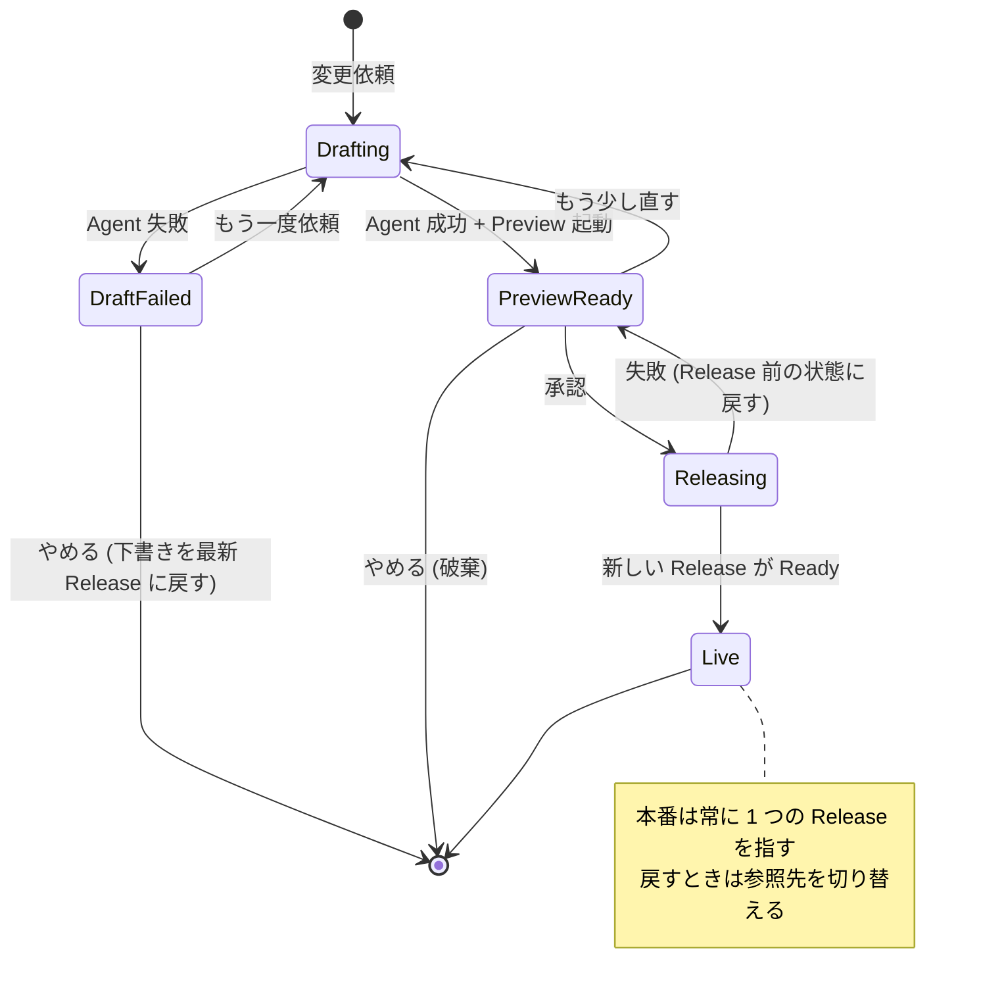
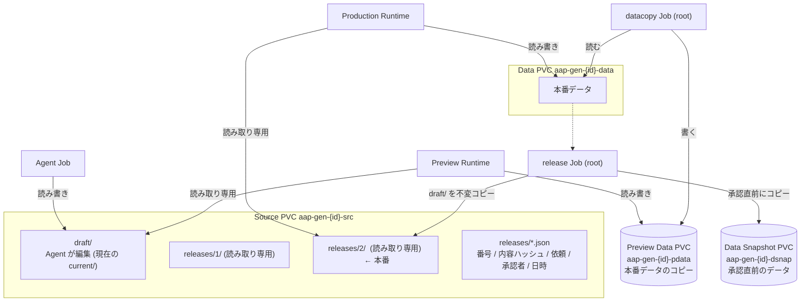
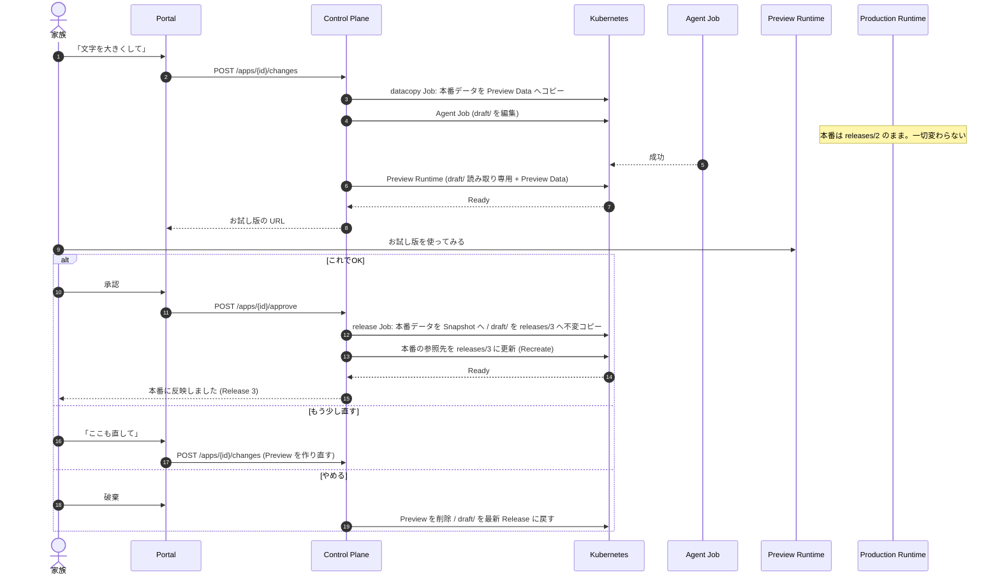
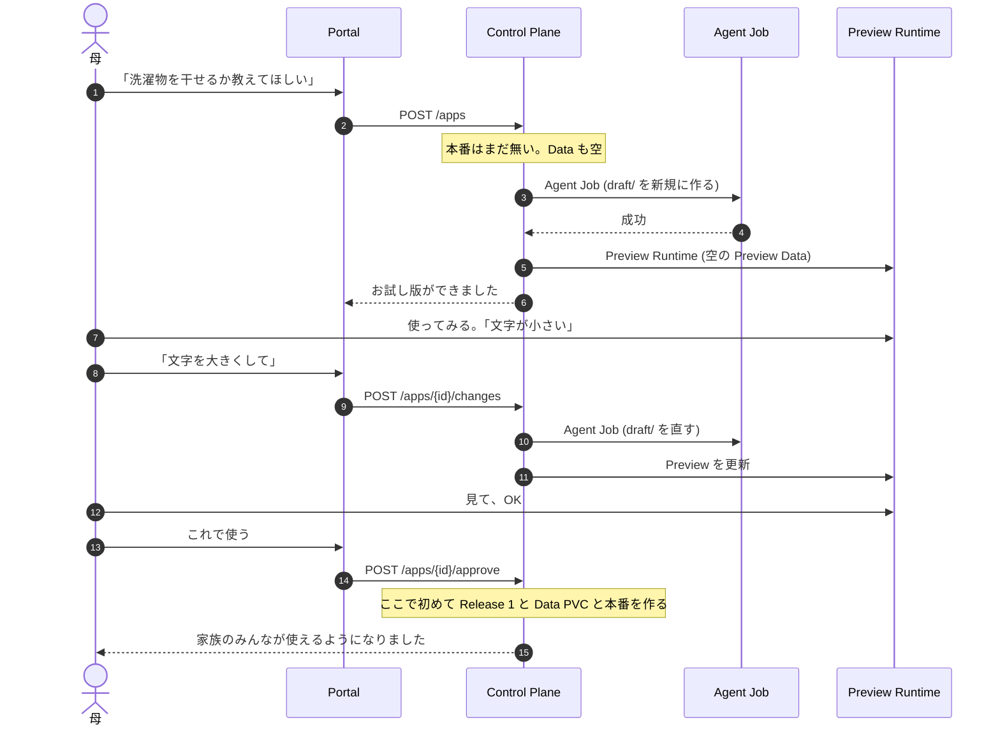

# 深掘り実装案: 「AI の成果物を何度も直したい」から、Preview と Release を設計する

CNDW 学生プロポーザルの技術的な深掘りの案。**ユースケースから出発し、インフラの設計に落とす**。
現状の構成は [`architecture.md`](architecture.md)、実装中に起きた問題は [`dev-log.md`](dev-log.md)。

> **問い**: 非エンジニアが AI に何度も直してもらうとき、「いま家族が使っているアプリ」と「直している途中のアプリ」を、
> インフラはどう分け、どう承認され、どう戻せるべきか。

---

## 0. 深掘りの核: ストレージの CoW で、Release と Preview データを作る

> **主張**: Release を「作業ツリーの CoW クローン」、Preview のデータを「本番データの CoW クローン」にし、
> アプリごとの容量を**ファイルシステムで強制**する。速い道(Preview)と遅い道(Release)の両方が、同じストレージの性質の上に立つ。

これまでの案では、承認時に `cp -a`(`node_modules` ごと)、Preview のデータ用に `datacopy` Job(全コピー)を使うとしていた。
どちらも「コピーの量に比例して遅く、ディスクを食う」。ストレージ側で解決する。

### 0.1 実測(✅)

`hack/bench-storage.sh` を、この Mac の Docker の Linux VM(カーネル 6.8、aarch64、ループデバイス上の 3 GiB)で実行。
各 5 回の**中央値**。`sync` を含む。環境の詳細は §0.3。

**Release の作成とロールバック(作業ツリーの複製)**

| ツリー | 方式 | Release 作成 | 追加ディスク | ロールバック |
|---|---|---|---|---|
| 大: 9,193 ファイル / 324 MiB(実際の `node_modules`) | ext4 全コピー(**今のワーカー相当**) | 1.07 s | **352.7 MiB** | 1.33 s |
| 大 | XFS 全コピー(`--reflink=never`) | 1.51 s | 355.1 MiB | 1.36 s |
| 大 | **XFS reflink** | **0.22 s** | **5.8 MiB** | **0.33 s** |
| 小: 8 ファイル / 36 KiB(**Agent が実際に作ったアプリ**) | すべて | 5〜9 ms | 0 | 4 ms |

- 大きなツリーで、reflink は全コピーより**約 5 倍速く、追加ディスクは約 1/60**。
  10 世代の Release を持つと、全コピーは約 3.4 GiB、reflink は約 58 MiB(上の値からの単純計算)。
- **小さなツリーでは差が出ない**。いまの天気・買い物アプリは依存が 1 つもなく、どの方式でも数ミリ秒。
  → 「いま遅いから変える」ではなく、**依存や大きなデータを持つアプリが増えても、Release のコストが増えない余地**として語る。
- 全コピーの基準が重要: GNU の `cp` は既定が `--reflink=auto` で、XFS では黙ってクローンする。比較するときは `--reflink=never` を付ける
  (最初の実行でこれに気づいて直した。記録: dev-log)。

**Preview 用データのクローン(本番データのコピー)**

| 確認 | 結果 |
|---|---|
| 200 MiB のデータファイルを、別の PVC のディレクトリへクローン(同じ XFS、別々の bind mount) | **9 ms、追加ディスク 0 MiB** |
| クローン側を 1 MiB 書き換える | 追加ディスク 1.0 MiB(CoW)。**本番側は無変更** |
| ファイルシステムをまたぐクローン(ext4 ↔ XFS) | **失敗**(`Cross-device link`) |

**容量の強制(アプリごとのディレクトリに 10 MiB の上限を付け、100 MiB を書く)**

| 方式 | 結果 |
|---|---|
| ext4、クォータなし(**今のワーカー**) | 強制されない。100 MiB 書けた |
| ext4 + プロジェクトクォータ | この環境では測れない(カーネルにクォータ機能なし) |
| **XFS + プロジェクトクォータ** | **強制された**(10 MiB で書き込み失敗) |
| 専用の 10 MiB のボリューム | 強制された(8 MiB で失敗。fs の管理領域の分を除く) |

### 0.2 この結果から決まる設計

1. **生成アプリ用の専用ディスクを足し、XFS(reflink + プロジェクトクォータ)にして、`/opt/local-path-provisioner` をそこに置く。**
   ワーカーの現状は ext4 on LVM で、reflink もクォータも無い。
2. **1 つのアプリの Source、Data、Preview Data、Release は、すべて同じ XFS に置く。** ファイルシステムをまたぐとクローンできない。
   → local-path の置き場所を 1 つの XFS に統一する。
3. **Release 作成は `cp --reflink=always`**(`releases/<n>.tmp` に作って rename)。**Preview データは本番データのクローン**で、`datacopy` Job が秒未満になる。
4. **容量はプロジェクトクォータで強制する。** PVC ごとのディレクトリに project ID を割り当てる仕組みが要る
   (`local-path` は行わない)。候補: 小さな Controller / helper Job で `xfs_quota` を呼ぶ、容量を強制する hostpath の PV プロビジョナー(OpenEBS など。**未検証**)、LVM。

### 0.3 まだ測れていないこと・注意(🔜)

| 項目 | 状態 |
|---|---|
| **LVM の thin スナップショット**(ファイル数に依存しない O(1)、原子的) | この環境のカーネルに dm-thin-pool が無く**測れなかった**。実際のワーカーのカーネル(Ubuntu 26.04)で測る |
| ext4 のプロジェクトクォータ | 同上(カーネルにクォータ機能なし)。実機で測る |
| 実際のワーカーでの値 | 上の値は Docker VM(仮想ディスク上のループデバイス)。**絶対値は変わる**。比(5 倍、1/60)の傾向が実機でも出るかを確かめる |
| **reflink はディレクトリ全体の原子的なスナップショットではない** | ファイルごとのクローンなので、書き込み中のツリー・データを複製すると**途中状態**が混ざりうる。Release は Agent の完了後(ツリーが静止)に作る。**稼働中の本番データを Preview 用にクローンする場合は要検討**(一時停止、`fsfreeze`、LVM のスナップショットで原子的に取る、など) |
| reflink の時間はファイル数に比例 | 9 千ファイルで 0.2 s。10 万ファイルでは? ファイル数のスイープを取る |
| Kubernetes 上の経路 | helper Job が `cp --reflink` を使う実装と、Pod が ENOSPC を受けたときの挙動(アプリのクラッシュ、Agent の失敗の見え方) |

---

## 1. なぜこれを深掘りするか(ユースケース → 設計)

実際に起きたことだけを根拠にする(記録は dev-log に残っている)。

| # | 実際に起きたユースケース | 困りごと | 設計 | 状態 |
|---|---|---|---|---|
| U1 | 天気アプリを**3回**直した(スピナーが消えない → キャッシュ → URL のバージョン) | 直している途中の壊れたアプリを、家族もそのまま見る。直ったかは画面を見ないと分からない | **Preview(お試し版)**: 下書きと本番を分ける | **未実装** |
| U2 | 「直したのに直っていない」 | どの版を見ているのか分からない。古い版が CDN・ブラウザに残る | **Release の同一性**: 承認した版に番号と内容ハッシュを付ける | 部分的(URL にバージョン) |
| U3 | 変更が失敗して元に戻った | データは無傷だったが、**変更でデータの形が変わっていたら**戻せない | **image + data を 1 つの release として戻す**(Data のスナップショット) | 未実装 |
| U4 | 失敗の理由が分からない / やり直したい / 消したい | 母は `kubectl` を使えない | 失敗の日本語化、retry、delete | 実装済み |
| U5 | 外の情報(天気)を使いたい | 外に出られず偽の値が出た | egress の許可(公開 HTTPS のみ) | 実装済み |

**U1〜U3 が同じ問題の別の顔**であり、これを 1 つの設計で解くのが深掘りの中身。
U4・U5 は、同じ流れで先に作ったものとして、物語の前半に置ける。

---

## 2. 用語

| 用語 | 意味 |
|---|---|
| **Draft(下書き)** | Agent が編集中のソース。家族には見せない |
| **Preview(お試し版)** | Draft を実際に動かしたもの。別の URL。**本番データのコピー**で動く |
| **Release** | 承認された、**変更できない**ソースの版。番号(1, 2, …)と内容ハッシュを持つ |
| **Production(本番)** | 特定の Release を読み取り専用で動かしている実行環境。家族が使う |
| **Data** | 家族の実データ。Production だけが書き込める |

---

## 2A. 要件の非対称性: 「速さ」と「正しさ」の 2 つの速度

ユースケースから出てくる要件は、段階によって**まったく逆**になる。

| | **直している途中**(Draft → Preview) | **これで決定したあと**(Release の作成と切り替え) |
|---|---|---|
| 利用者の期待 | **すぐ**直った版を見たい(待つと試行錯誤が止まる) | 多少**時間がかかってもよい**(「完成版を作っています」で待てる) |
| 最適化の対象 | **遅延**(最初の変化が見えるまでの時間) | **正しさ・再現性・安全**(壊さない、戻せる) |
| 許容する不完全さ | 不完全でよい(捨てる前提。途中の壊れたコードも見える) | 不完全は許さない(本番は壊せない) |
| 実行の形 | **可変な作業ツリー**を、そのまま動かす | **不変の成果物**にして動かす |

> **設計の方針**: 1 つのアプリを、**2 つの形**で扱う。
> 速い道は「可変の作業ツリー(PVC)をそのまま動かす」。遅い道は「不変の成果物(image)にして、検証してから切り替える」。
> **2 つをつなぐ変換(昇格)を安全にすること**が、深掘りの中身になる。

### 2A.1 速い道の工夫(遅延を縮める)

| # | 工夫 | k8s の部品 | 効果 |
|---|---|---|---|
| F1 | 作業ツリーを PVC で共有し、Agent→Preview を**零コピー**にする | PVC + `subPath` + `readOnly`(§3.7、X1・X2) | build / push / pull が消える |
| F2 | Preview は**常駐**させ、ファイルの変更をプロセス内で再起動(`node --watch`) | Deployment を 1 つ維持(Pod を作り直さない) | 1 回あたり 8〜10 秒の入れ替えが 0.5 秒に |
| F3 | 変化を**書いている途中から**見せる(SSE + ホットリロード) | Control Plane の SSE(実装済み) | 最初の変化が見えるまでの時間 |
| F4 | Agent の起動を速くする: image のダイジェスト固定 + `IfNotPresent` | `imagePullPolicy` | 起動 1〜9 秒 |
| F5 | **優先度でスケジュールする**: 対話の Pod(Agent・Preview)を、重い作業(build・バックアップ・画面確認)より優先 | **PriorityClass**(`aap-interactive` > `aap-batch`)。batch は `preemptionPolicy: Never` | worker は 5 GB。重い build が裏で走っても、対話の遅延が悪化しない |
| F6 | 速い道の検証は**軽く**: 起動確認と主要画面の煙テストだけ | Job を小さく | 待ち時間の短縮 |
| F7 | 簡単な修正は軽いモデルへ振り分け | (モデル側) | LLM の 80% の部分 |

### 2A.2 遅い道の工夫(時間をかけて正しくする)

| # | 工夫 | k8s の部品 | 効果 |
|---|---|---|---|
| S1 | **昇格を Job のキューにする**(同時実行 1)。時間を気にせず、優先度は低く | Control Plane のキュー + `aap-batch` の Job | 小さい worker でも、メモリを使い切らない |
| S2 | **再現できる成果物にする**: `npm ci`、依存を固定、基盤 image をダイジェストで記録 → image にする(または不変の `releases/<n>/`) | BuildKit(rootless)の Job、レジストリ | 「作業ツリーでは動いたが、成果物では動かない」を潰す |
| S3 | **検証を厚く**: 全テスト + ヘッドレスブラウザの画面確認 + 依存の脆弱性スキャン | 検証用の Job(使い捨て) | 利用者に見える失敗を、昇格の前に捕まえる |
| S4 | **データの予行演習**: 新しい版を、**本番データのコピー**で起動して確認 | datacopy Job + Preview Data(§3.2) | データの形が変わる変更を、本番に当てる前に検出 |
| S5 | **見守り時間**: 切り替えのあと一定時間ヘルスを監視し、悪ければ自動で戻す | readiness / 監視 + 自動ロールバック | 時間がある段階だからできる、遅い検証 |
| S6 | 切り替えの直前に **Data のスナップショット** | helper Job | 版とデータを 1 組で戻せる(§3.4) |

> **切り替えは、ゼロダウンタイムにできない**: 本番の Data は 1 つの書き込み手を前提にしている(RWO、ファイルベースの保存)。
> 古い版と新しい版を同時に動かして Data を共有すると、書き込みが競合する。
> そのため切り替えは `Recreate`(数秒の停止)のままにして、**停止を短くするために、昇格の前に全部を検証する**(S2〜S4)。
> 「遅い道で時間を使う代わりに、切り替えの瞬間は短くする」という設計。

### 2A.3 つなぎ目の危険: 作業ツリーと成果物のずれ(Preview と Production の差)

速い道(PVC 上の作業ツリー)と遅い道(build した成果物)で**動き方が変わりうる**。
(例: ネイティブの依存、環境変数、ファイルの権限、`npm install` の結果の違い)

| 対策 | 内容 |
|---|---|
| 同じ App Contract | `PORT` / `/healthz` / `/data` / `npm start`。Preview と Production で同一 |
| 昇格前の同値確認(S3) | 成果物を**お試し版と同じ煙テスト**にかけ、結果を比べる |
| 実験で測る | 同じソースを Preview と成果物の両方で動かし、差が出る頻度を数える(E14) |

---

## 3. 設計の全体像

### 3.1 状態

- **本番は、承認されるまで一切変わらない。** Agent が触るのは Draft だけ。
- **作成も変更も同じ流れ**: 作成したときも、まずお試し版ができ、直して、承認した時点で Release 1 が生まれ、
  本番が始まる(§3.5)。「最初の作成だけ特別」という例外を作らない。

### 3.2 ストレージ(volume 案)

| 領域 | 書き込める主体 | 補足 |
|---|---|---|
| `draft/` | Agent Job | これまでの `current/` |
| `releases/<n>/` | release Job(信頼するもの)のみ。作成後は読み取り専用 | 書き込み不可にして内容ハッシュを記録する |
| Production の Data | Production Runtime のみ | Agent・Preview には渡さない(既存の方針) |
| Preview Data | Preview Runtime | **捨てる前提**。承認しても本番には反映しない |
| Data Snapshot | release Job のみ | 承認直前の本番データ。戻すときに使う |

### 3.3 変更 → お試し → 承認

### 3.4 戻す(Rollback)

- **ソースだけ戻す**: 本番の参照先を `releases/<n-1>` に更新する。コピーも build もないので速い。
- **ソースとデータを戻す**: 承認時に取った Data Snapshot から Data を復元し、同時に参照先を戻す。
  変更でデータの形が変わっていても、**release 単位で整合した状態に戻れる**。
- 1 件の Release は `{番号, 内容ハッシュ, Data Snapshot の ID, 依頼, 承認者, 日時}` で 1 組。

### 3.5 作成も同じ流れ(母が作ったその場で、お試しして、すぐ直せる)

- 承認するまで、**そのアプリは家族の一覧に「作成中」としてだけ現れる**(本番の URL は無い)。
  途中のアプリを、他の家族が使ってしまうことがない。
- 失敗しても、本番が中途半端に残らない(いまは作成に失敗すると PVC と失敗したアプリが残る)。
- お試し版の Data は空で始まる。本番ができる前なので、コピーするものがない。
  入力した内容は承認で本番に持ち越さない(§6)。
- **直すまでの速さ**は、インフラではなく Agent(LLM)が決める。実測では、作成が約 2 分半、変更が約 1 分。
  プレビューの起動そのものは数秒(Pod 1 つ)で、ここでは遅くならない。

---

### 3.6 修正サイクルを速くする(実測と工夫)

> 利用者が感じる速さ = **修正の回数 × 1 回あたりの時間**。Preview は後者を、自動の画面確認は前者を縮める。

**実測(天気アプリの実際の記録。ホームクラスタ、Gemini `gemini-3.8-flash`)**

| 区分 | 修正 82 秒 | 修正 56 秒 | 作成 212 秒 |
|---|---|---|---|
| Agent Pod の起動(image 取得を含む) | 9 s | 1 s | 1 s |
| Agent の実行(LLM + テスト) | 60 s | 44 s | 195 s |
| snapshot / init の Job | 3 s | 3 s | 7 s |
| 本番の入れ替え(Pod 再作成 + 起動確認) | 7 s | 5 s | 6 s |

インフラが占めるのは 1 回の修正の **約 15〜20%**(9〜13 秒)。残りは LLM とテスト。

| # | 工夫 | 縮めるもの | 見込み |
|---|---|---|---|
| T1 | **Preview は Pod を作り直さず、ファイルの変更を反映する**(`node --watch`)。Agent と Preview は同じ volume を共有しているので、Agent が書いた瞬間に反映できる。Preview は承認までずっと動かしておく | 1 回あたり: snapshot (3 s) と入れ替え (5〜7 s) がほぼ 0 に。さらに**完成を待たずに変化が見える**(最初の変化が見えるまでの時間) | インフラ分をほぼ消せる |
| T2 | **自動の画面確認 Job**: Agent の後にヘッドレスブラウザで画面を開き、コンソールエラーと「読み込み中が消えるか」などを確認。問題があれば自動で Agent に差し戻す(上限 N 回) | **利用者に見える修正の回数**。天気アプリの 3 回は Node のテストでは見つからなかった | 回数の削減(要測定) |
| T3 | Agent の image をダイジェスト固定 + `imagePullPolicy: IfNotPresent` | 起動 1〜9 s | 小さい |
| T4 | 会話の引き継ぎ、簡単な修正は軽いモデルへ振り分け | LLM の 80% の部分 | **測らないと不明**(インフラではなくモデル側) |
| T5 | 複数案を Job で並列に作って選ぶ | 1 回の品質(= 回数) | 費用が数倍。worker は 5 GB。今回は見送り |

T1 と T2 が k8s の持ち味(共有 volume、使い捨ての Job)で実現でき、実験で効果を示せる。

---

## 3.7 PVC を使うこと自体が、設計の工夫になる(実験で確かめた)

Release の置き場として、PVC のほかに image(レジストリ)、オブジェクトストレージ(R2/S3)、ConfigMap、`emptyDir`、`hostPath` も選べた。
**PVC を選んだ理由**と、**実験で分かった限界**を分けて書く。

### 選んだ理由: 1 つの PVC を、役割ごとに別の権限で共有できる

| | Agent | Preview | Production |
|---|---|---|---|
| 同じ Source PVC の見え方 | `draft/` を**読み書き** | `draft/` を**読み取り専用** | `releases/<n>/` を**読み取り専用** |
| 実現方法 | `subPath` + `readOnly` | 同左 | 同左 |

- **受け渡しが零コピー**: Agent が書いたファイルを、build も push も pull もなく、同じ volume 越しに別の Pod が読む。
  image 案に必要な「build → レジストリ → pull」が無い。これが §3.6 の T1(ホットリロード)を可能にする。
- **信頼境界を volume の mount で表せる**: 書けるのは Agent だけ、Production は読み取り専用、というのを Pod の spec で宣言できる。
- **寿命が Pod から独立**: Pod が消えても、Source と Data は残る。Source と Data は別 PVC なので、ソースを作り直してもデータは残る。

| 選択肢 | 受け渡し | 隔離(読み取り専用の強制) | Pod をまたぐ永続 | 自宅での重さ |
|---|---|---|---|---|
| **PVC** | **零コピー** | mount の `readOnly` / `subPath` | ○ | 軽い |
| image(レジストリ) | build + push + pull | image は不変 | ○(レジストリ) | 重い |
| オブジェクトストレージ(R2/S3) | ダウンロード / アップロード | 認証情報で制御 | ○ | ネットワーク依存 |
| ConfigMap | API 経由 | RBAC | ○ | 1 MiB までで、`node_modules` は入らない |
| `emptyDir` | 同じ Pod 内のみ | - | ✕(Pod とともに消える) | 軽い |
| `hostPath` | ノード上のパス | **PSA で禁止**(baseline 以上) | ○ | 安全でない |

### 実験で確かめたこと(検証用 kind クラスタ、`local-path`)

| # | 確認したこと | 結果 |
|---|---|---|
| X1 | 別の Pod が書いたファイルの変更が、読み取り専用で mount した Pod の `node --watch` に届くか | **届いた**。書き込みから再起動まで **0.5 秒以内**(`kubectl` の往復を含む) |
| X2 | 読み取り専用の mount に、書き込めるか | **拒否された**(`Read-only file system`) |
| X3 | **10Mi の PVC に 100MB 書き込めるか** | **書き込めた**。`local-path` は PVC の容量指定を強制しない。`df` に出るのはノードのディスク全体 |

### 限界(X3 から): 容量の上限は名目だけで、暴走するとノードのディスクが埋まる

- いまの設計の「Source 1Gi / Data 1Gi」は**助言であって上限ではない**。バグのあるアプリや暴走した Agent が、
  worker のディスク(約 46 GB。image、ログ、Prometheus も同居)を埋めうる。
- 埋まると、**他のアプリや Platform 自身**も書けなくなる(影響範囲がノード全体)。
- 対策の候補(強い順):
  1. **容量を強制するストレージにする**: XFS のプロジェクトクォータ、LVM の論理ボリューム(OpenEBS LVM LocalPV など)、Longhorn。
  2. **blast radius を小さくする**: 生成アプリ用に**専用の仮想ディスク**を worker に足し、`/opt/local-path-provisioner` をそこに置く。
     埋まっても影響は生成アプリの領域だけで済む(自宅の VM ならすぐできる)。
  3. **検知と制限**: 使用量を定期的に測る(`du`)Job + しきい値で Agent / アプリを止める、Prometheus のアラート。
  4. Agent への指示に上限を書く(助言にとどまる)。

### もう 1 つの制約: RWO と単一ノード

- PVC は `ReadWriteOnce`。同じノードの複数の Pod が mount できるので成立しているが、
  `local-path` の PV はノードに固定される(node affinity)ため、**そのアプリの Agent / Preview / Production は全て同じノードで動く**。
- いまは worker が 1 台なので問題ない。**worker を増やすと、Agent を別ノードに逃がせない**(PV のあるノードに縛られる)。
  RWX のストレージ(NFS など)にすれば外れるが、**零コピーの受け渡しと容量強制の両立**が論点になる。
- `ReadWriteOncePod` にはできない(複数の Pod が同時に mount するため)。

### 実験の追加

| # | 実験 | 測るもの |
|---|---|---|
| S1 | **Release 作成のスイープ**(§0) | 実機のワーカーで、ファイル数 1 千 / 1 万 / 10 万のツリーを、全コピー・reflink・(可能なら)LVM thin で作成・ロールバック | 時間とディスクの増加が、ファイル数にどう比例するか | reflink は O(ファイル数)、LVM thin は O(1) |
| S2 | **Preview データのクローン** | データ 10 MiB〜2 GiB で、全コピーと reflink を比較。複数ファイル構成も | 時間とディスクの増加 | reflink はサイズにほぼ依存しない |
| S3 | **クォータの強制と暴走の封じ込め**(E10 を置き換え) | XFS プロジェクトクォータ付きで、暴走するアプリ・Agent を起動。ほかのアプリと Platform への影響を確認。Pod が ENOSPC を受けたときの挙動 | 影響の範囲、ほかのアプリの継続 | 暴走した 1 つだけが止まる |
| S4 | **複製の整合性**(§0.3) | 書き込み中のツリー・データを reflink し、複製の中身が壊れた状態になる頻度を数える。静止させる方法(一時停止、`fsfreeze`、LVM スナップショット)を比較 | 不整合の発生率と、止める時間 | 静止なしでは不整合が起きうる |
| S5 | **K8s 上の経路** | Control Plane の helper Job を reflink に置き換えて e2e を再実行。同じ XFS をまたぐ PVC のクローン | e2e が通るか、Release 作成の時間 | 通る |
| E10 | **ディスク埋め込み**: 暴走するアプリ(`/data` に書き続ける)と暴走する Agent(`draft/` に書き続ける)を起動 | 他のアプリ・Platform が影響を受けるまでの時間と範囲。対策 2・3 の導入後との比較 |
| E11 | **ホットリロードの境界**: ファイルが多い(`node_modules` の更新)、書き込みが連続する、Agent の途中状態(壊れたコード)で、お試し版がどう振る舞うか | 再起動の回数・反映の遅れ・クラッシュループになるか |

---

## 4. 2 つの案を作って比べる

> **§2A の考え方では、A と B は二者択一ではない**。速い道は A(PVC の作業ツリー)、遅い道の成果物は B(image)の
> **ハイブリッド**が本命になる。以下の比較は「遅い道の成果物を、volume で作るか image で作るか」を決めるためのもの。(深掘りの核)

| | **A. volume 案**(本命) | **B. image 案**(plan-2 の Stage 2) |
|---|---|---|
| Release の実体 | `releases/<n>/`(不変のディレクトリ) | レジストリの image(ダイジェスト) |
| 承認時にすること | `cp -a` + 読み取り専用 + ハッシュ記録 | rootless BuildKit で build → push |
| 必要なコンポーネント | なし(helper Job だけ) | レジストリ(GHCR か in-cluster) + BuildKit + 標準 Dockerfile |
| Rollback | Deployment の参照先を切り替える | image のダイジェストを切り替える |
| 再現性 | 弱い(実行する基盤の image の更新に依存) | 強い(依存も OS も固定) |
| ディスク | `node_modules` ごとコピー。世代を制限する(例: 直近 5 世代) | レイヤーの共有で小さい |
| 自宅サーバーとの相性 | 軽い。**worker は 5 GB** | build のメモリと時間が重い |
| 失敗モード | ディスクフル、コピーの途中失敗 | build 失敗、レジストリの外部依存 |

> **更新(§0)**: A の「Release 作成」は、`cp -a` ではなく **reflink クローン**にする(大きなツリーで約 5 倍速く、追加ディスク約 1/60 を実測)。
> これで A の弱点だった「ディスクを食う」「コピーが遅い」が薄まる。B(image)との比較は、この改良した A を相手にする。

**仮説**: 家庭の規模では A のほうが「運用の複雑さ」と「戻す速さ」で優り、B は「再現性」で優る。
**測って確かめる**(§7)。B は同じ App Contract で動く最小のプロトタイプ(spike)を作り、同じ実験にかける。

---

## 5. 変更が入る箇所(現在のコードに対して)

| 場所 | 変更 |
|---|---|
| `control-plane/internal/store` | `releases` テーブル(app_id, n, source_hash, data_snapshot, prompt, approved_by, created_at)。apps に `live_release`、draft の状態。列追加は既存のマイグレーション方式に倣う |
| `control-plane/internal/kube` | `EnsureRuntime` に Release 番号を渡す(subPath を `releases/<n>` に)。`EnsurePreview`、helper の役割 `datacopy` / `release` / `dsnap-restore` を追加。PVC `-pdata` と `-dsnap`。Preview 用 Ingress(`{id}-preview.<ドメイン>`) |
| `control-plane/internal/orchestrator` | **作成の流れを組み替える**: Agent → Preview で止まり、承認で初めて Data PVC / Release 1 / 本番を作る。`runBuild` を分割: `runDraft`(Agent + Preview)/ `runApprove`(Release)/ `runRollback`。**各手順を冪等に**(`releases/<n>.tmp` に作ってから rename、名前は決定的) |
| `control-plane/internal/api` | `POST /apps/{id}/approve`、`/discard`、`/rollback`、`GET /apps/{id}/releases`。`/changes` の意味が「本番を変える」から「下書きを作る」に変わる(互換性に注意) |
| `portal` | 変更後の画面: 「お試し版を開く / これでOK / もう少し直す / やめる」。「前の版に戻す」の一覧。承認者は Access のヘッダー(`Cf-Access-Authenticated-User-Email`)から記録 |
| `kubernetes-platform` | **PriorityClass** `aap-production` > `aap-interactive`(Agent・Preview)> `aap-batch`(昇格・build・画面確認、`preemptionPolicy: Never`)。NetworkPolicy に `role=preview` を追加(runtime と同じ egress / ingress)。Access のワイルドカードは既存の `*.kanke-aap-gen.com` でカバー済み。予約語に `*-preview` を追加 |
| **ストレージ(§0)** | ワーカーに専用の仮想ディスクを足して XFS(`reflink=1`、`prjquota`)にし、local-path の置き場所をそこへ。helper の `snap` / `release` / `datacopy` を `cp --reflink=always` に。PVC ごとの project ID と上限を設定する仕組み(helper か小さな Controller)。Pod が ENOSPC を受けたときの扱い |
| `hack/e2e-kind.sh` | シナリオを追加(§7 の実験の自動化) |

---

## 6. 設計判断とその理由

| 判断 | 理由 |
|---|---|
| **作成も変更も、必ずお試しを経る** | 試行錯誤がいちばん多いのは最初の版。例外を作らないほうが、仕組みも画面も単純。最初の承認で Release 1 と本番ができる(旧案の「作成は承認なし」は取り下げた) |
| Preview は**本番データのコピー**で動く | 空のデータでは「いつもの表で見える」を確認できない。直接 mount すると、試した入力が本番を汚す |
| Preview の書き込みは捨てる | 承認で本番に混ぜない。混ぜるとデータの形の違いを持ち込む |
| 本番の参照先は Deployment の subPath で明示 | シンボリックリンクは subPath 経由で安全に扱えない。参照先がクラスタ上の宣言として残る |
| Release は不変にしてハッシュを記録 | 「どの版を見ているのか」(U2)に答える。ロールバックの対象が曖昧にならない |
| 承認と Release を**状態機械**にする | 途中で落ちても続きから収束できる(§7 の E6)。plan-2 の Reconciliation の話につながる |
| 世代は制限(直近 N) | worker のディスクは有限。古い Release は削除する |

---

## 7. 実験計画(「最初の設計 → 壊れた → 設計変更 → 検証」を作る)

| # | 実験 | やり方 | 測るもの | 期待 |
|---|---|---|---|---|
| E1 | **壊れた状態を家族が見る回数** | 天気アプリの実際の 3 回の修正を台本にして、Stage 1(現状)と新設計で再生。本番 URL を 2 秒おきに監視 | 壊れた応答(非 200 / 古い・壊れた画面)の回数と時間 | 新設計は 0 |
| E2 | **反映の同一性** | 承認後、本番が返す版(ハッシュ)と Release の一致を確認。ブラウザ・CDN の古い版が残る時間 | 古い版が見えた時間 | 0(Release 番号を応答に付ける) |
| E3 | **ロールバック** | (a) ソースだけ (b) データの形を変える変更のあとに戻す。データのハッシュを比べる | 戻す時間、データの無傷さ | (b) はデータも戻る |
| E4 | **volume 案 と image 案** | 同じアプリで承認を 10 回。時間、ディスク、メモリ、ロールバックの時間、コンポーネント数を比べる | 承認に要する時間 / ディスクの増え方 / 戻す時間 | A は速くて軽い、B は再現性 |
| E5 | **Preview の隔離** | Preview から本番 Data への書き込み、本番 Service への通信、Agent から releases の書き込みを試みる | すべて失敗すること | 全て遮断 |
| E6 | **承認の途中障害** | 承認の各手順の間で Control Plane を kill / helper Job を失敗させる | 再開後に同じハッシュの同じ Release に収束するか。中途半端な Release が残るか | 収束する |
| E8 | **1 回あたりの時間の内訳**(T1・T3) | 同じ修正を、Stage 1(Pod 再作成)と T1(ホットリロード)で 10 回ずつ。Pod 起動 / Agent 実行 / 入れ替え / 最初の変化が見えるまでを記録 | 完了までの時間と**最初の変化が見えるまでの時間**の分布 | 後者が大きく縮む |
| E9 | **自動の画面確認で修正の回数が減るか**(T2) | 天気アプリの 3 回の修正を再現できる依頼で、画面確認あり / なしを各 10 回。利用者に見える失敗(くるくる残り、コンソールエラー)の回数を数える | 利用者に見える修正の回数、追加の時間、メモリ | 回数が減り、時間の増加は許容範囲 |
| E10 | **ディスク埋め込み**(§3.7) | 暴走するアプリ・Agent を起動し、影響の範囲と時間を測る。対策の前後で比較 | 他への影響の有無と範囲 | 対策なしでは広範囲、専用ディスクで限定 |
| E11 | **ホットリロードの境界**(§3.7) | 壊れたコード、連続書き込みでのお試し版の挙動 | 再起動回数、反映の遅れ | クラッシュループにならない設計が要る |
| E12 | **対話の遅延 vs 重い作業**(F5・S1) | 裏で重い Job(build 相当のメモリ・CPU 消費)を走らせながら、Preview の更新と Agent の起動の時間を測る。PriorityClass の有無で比較 | 最初の変化が見えるまでの時間の悪化 | PriorityClass で悪化が抑えられる |
| E13 | **データの予行演習で、データを壊す変更を捕まえられるか**(S4) | データの形を壊す変更を意図的に作り、予行演習あり / なしで本番に当てる | 本番データへの被害の有無 | 予行演習ありで、被害は 0 |
| E14 | **作業ツリーと成果物の差**(§2A.3) | 同じソース(Agent が実際に作ったアプリ 10 個)を Preview と成果物の両方で動かし、煙テストの結果を比べる | 差が出た割合と原因 | 差は小さいが 0 ではない。差の原因が設計材料になる |
| E15 | **切り替えの停止時間**(S1〜S6) | 本番を 1 秒おきに監視しながら昇格。`Recreate` と、予行演習済みの切り替えで比較 | 停止の秒数 | 数秒。ゼロにはならない理由を示せる |
| E7 | **実ユーザー** | 母に**作るところから**使ってもらい、お試し版を理解できるか、承認までに何回直したかを記録 | 修正の回数 / 迷った箇所 / 承認の理解 | 記録そのものが成果 |

E1・E3・E6 が、発表の山場になる。**いまの設計(Stage 1)で E1 を先に測っておく**と、「導入前」の数字が手に入る。

---

## 8. マイルストーン

| M | 内容 | 完了の条件 |
|---|---|---|
| M0 | **Stage 1 の E1 の測定**(導入前の数字) | 天気アプリの台本で、壊れた応答の回数と時間が出ている |
| M0s | **ストレージ軸の実機計測**(§0.3): ワーカーに仮想ディスクを足す前に、検証用の Linux(別 VM か kind のノード)で S1・S2・S4 を実施。LVM thin とクォータを実カーネルで測る | §0 の表が実機の値で埋まり、LVM thin の行ができる |
| M1 | データモデル + 本番を `releases/1` に固定(Preview なし)。承認相当の処理で Release 1 を作る | 既存のテストが通り、本番が release のディレクトリで動く |
| M2 | Preview の実行(別 URL、データのコピー) + NetworkPolicy | E5 が通る |
| M3 | approve / discard / rollback の API + Portal の画面 | e2e で、お試し → 承認 → 反映 → ロールバックが通る |
| M3b | Preview のホットリロード(T1) + 自動の画面確認 Job(T2) | E8・E9 が測れる |
| M4 | E1〜E3、E6 の実施と dev-log | 数字と失敗の記録がある |
| M5 | image 案の spike + E4 / ハイブリッド(速い道 = PVC、遅い道 = image)の昇格 Job + E12〜E15 | A と B の比較表と、2 つの速度の効果が実測で埋まる |
| M6 | 母による実テスト(E7) | 記録がある |

---

## 9. リスクと未決事項

| 項目 | 内容 | 方針 |
|---|---|---|
| ディスク | `node_modules` ごとの Release が増える。**さらに `local-path` は PVC の容量を強制しない**(実験 X3) | 直近 N 世代で削除。生成アプリ用の専用ディスクと使用量の監視(§3.7、E10) |
| メモリ | Preview の分だけ Pod が増える。worker は 5 GB | Preview は 1 アプリにつき 1 つ、一定時間の無操作で停止。上限を決める |
| Data コピーの時間 | 大きいデータだとプレビューまで遅い | 現状のデータは小さい。上限を超える場合の方針は未決 |
| 「お試し版」であることの表示 | 生成アプリに印を埋め込めない | Portal の画面で明示。ホスト名に `-preview` を含める |
| 承認者 | Access のメールを記録するが、誰でも承認できる | 当面は家族全員。権限は未決 |
| データの形が変わる変更 | 本番に反映した直後は Snapshot でしか戻せない | Data Snapshot を必須にする。マイグレーションの方針(後方互換を基本)を App Contract に書く |
| お試し版を Portal の中で見せるか、別タブか | iframe に埋め込むと「見ながら直す」が 1 画面で済むが、Access のセッション(Cookie はホスト名ごと)と埋め込みの可否を実機で確認する必要がある。まず別タブで始める |
| 承認前のアプリの見え方 | 承認までは、作った本人にだけ「作成中」と出す。家族の一覧に出すかは未決(Access のメールで作成者を記録できる) |
| `/changes` の意味の変更 | 既存のクライアントの動作が変わる | Portal 以外のクライアントはまだ無い |
| reflink の原子性 | ツリー・データの複製は、書き込み中だと途中状態を含みうる(§0.3、S4) | Release は Agent 完了後に作る。稼働中データのクローンは静止の方法を決める |
| 別のファイルシステムをまたげない | クローンは同じ XFS の中だけ(`EXDEV`) | 1 つの XFS に統一。local-path の置き場所を 1 つにする |
| 専用ディスクの追加 | ワーカー VM に仮想ディスクを足し、既存の PVC を移す作業 | 先に検証環境で。移行はバックアップ(restic)を取ってから |
| クォータの割り当て | local-path は project ID を付けない | helper / 小さな Controller で付ける。強制できる PV プロビジョナーは未検証 |
| 再現性(volume 案) | 実行基盤 image の更新で挙動が変わりうる | 基盤 image のダイジェストを Release に記録する案を検討 |

---

> 3 幕の構成と根拠(実測 / 設計のみ / これから)の整理は [`talk-story.md`](talk-story.md)。

## 10. 発表での筋(案)

1. 母の紙の表 → アプリになる(ここまでの Platform)
2. **実際に触ると、作ったその場から何度も直したくなった**(天気アプリで 3 回。U1)
3. そのたびに本番が壊れ、直ったかも分からなかった(U2。E1 の「導入前」の数字)
4. **要件の非対称性**: 直している間は「すぐ見せる」、決定したあとは「時間をかけて正しく」(§2A)
5. 設計: 下書きと本番を分ける / 速い道は PVC の作業ツリー、遅い道は検証した不変の成果物 / データは別に保つ(§3)
6. **2 つの作り方を比べた**(volume と image。E4・E14)
7. 途中で落ちても収束する(E6) / 戻せる(E3)
8. 母は使えたか(E7)

> 結論の候補: 「AI に任せるほど、**人が確認して承認する地点**をインフラが作る必要がある。
> それは Kubernetes の既存の部品(Job、PVC、Deployment、NetworkPolicy)の組み合わせで、小さく実現できる」
