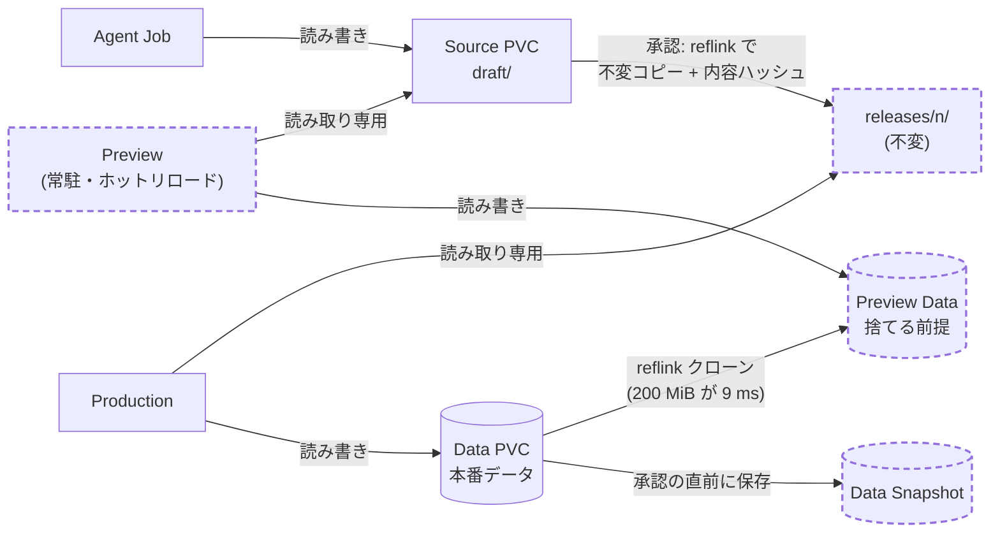

# 発表 10 分版: GitOps を外したら、状態の設計が必要になった

Cloud Native Days 学生プロポーザル向け。**メッセージは 1 つ、深掘りも 1 つ**に絞った版。
旧版(3 幕・速さ・隔離など)は [`talk-story.md`](talk-story.md)。数字の出典は [`measurements/log.md`](measurements/log.md)。

> **根拠の凡例**: ✅ 実測・検証済み / 📐 設計のみ(作っていない) / 🔜 これから
> 発表では、✅ だけを事実として話し、📐 と 🔜 はそう言う。

---

## 1. 一文で言うと

> **AI が何度も直すアプリを GitOps で回すと遅いので、アプリのコードを GitOps から外した。
> すると、Git が担っていた責務(永続・分離・戻す・履歴)を、ボリュームで引き取る「状態の設計」が必要になった。
> その現状と、最終形の話。**

**なぜ「状態の設計」か(理由の鎖)**

---

## 2. 構成(9 枚、約 9.5 分)

| # | 時間 | 内容 | 見せるもの | 根拠 |
|---|---|---|---|---|
| 1 | 0:45 | 母の紙の食事表。問い: AI が作ったソフトを、誰が動かし、直し続けるのか | 写真 / 表 | - |
| 2 | 0:45 | 最初の設計: Agent は `kubectl` を持たず Git に書く → Argo CD(GitOps)。履歴・差分・戻せる | 図 | 📐(plan) |
| 3 | 1:45 | **測った**: 1 回の修正に GitOps は約 7 分上乗せ。クラスタ内なら 約 2.7 分(うち LLM が約 7 割) | 棒グラフ | ✅ M-006・M-010・M-009 |
| 4 | 0:45 | 決断: **アプリのコードを GitOps から外す**。基盤(Platform・RBAC・NetworkPolicy)は GitOps のまま | 一言 | ✅ |
| 5 | 2:15 | **外すと何が要るか**: Git の責務を、ボリュームで引き取る(現状の状態の設計) | 表 + 図 | ✅ 下の §3 |
| 6 | 2:15 | **最終形の状態の設計**と、それが現状の穴を埋める | 図 1 枚 + 3 原則 | 📐 + ✅ 部分(M-003・M-004) |
| 7 | 0:45 | まとめ: GitOps は外側のループのもの。外したら、状態の設計で責務を引き取る | 一言 | |
| 8 | (予備) | 正直な補足: 速さの 9 割は LLM。インフラの役割は「待ち方」 | 表 | ✅ M-009 |
| 9 | (予備) | Q&A 用: 隔離、Reconciler、Cloudflare | | |

---

## 3. スライド 5 の中身: Git の責務 → 現状の状態の設計(✅)

| Git が担っていた責務 | GitOps を外すと | 引き取り方 | 検証 |
|---|---|---|---|
| **永続**(Pod が消えてもコードが残る) | コードの置き場がない | Source を **PVC** に。Pod の寿命から独立 | ✅ |
| **コードとデータの分離**(直しても家族のデータが壊れない) | 同じ場所に混ざりうる | **Source PVC と Data PVC を分ける**。Agent には Source だけ見せる | ✅ 更新後もデータが無傷(e2e) |
| **戻せる**(壊れたら直前に) | `revert` がない | 変更前に snapshot、失敗したら restore する Job | ✅ 失敗の 2 経路(e2e) |
| **履歴・バックアップ** | 履歴が消える | 毎晩 restic → R2(日 7 / 週 4 / 月 6)、復元の練習 | ✅ 復元に成功 |
| (新しい要件)**速い反映** | - | Agent と Preview が **同じ PVC を共有**(`subPath` + `readOnly`) | ✅ 0.5 秒以内 |

**言い方の注意**: 「Git の 4 つの責務」は筆者の整理。生成アプリの GitOps は作っていない(基盤で同じ仕組みを測った代用)。

---

## 4. スライド 6 の中身: 最終形の状態の設計(📐 + 部分的に ✅)

実線 = 現状で動いている(Source は今 `current/` で、Production もそこを読む)。破線 = 最終形で足すもの(設計のみ)。
すべて**専用の XFS ディスク(reflink + プロジェクトクォータ)の上**に置く。

**3 つの原則**
1. **役割ごとに mount の権限を分ける**(`subPath` + `readOnly`)。書けるのは Agent の `draft/` だけ、Production は不変の `releases/n/` を読む。
2. **コピーせずクローンする**(reflink)。Release の作成、Preview のデータ。ファイルシステムをまたぐとクローンできないので、1 つの XFS に統一する。
3. **上限をファイルシステムで強制する**(プロジェクトクォータ)。`local-path` は PVC の容量を強制しない。

**現状の穴を、最終形がどう埋めるか**

| 現状の穴 | 最終形での答え | 根拠 |
|---|---|---|
| 履歴の粒度が**日単位**(Git ではコミット単位) | 承認ごとの Release(番号・内容ハッシュ・Data スナップショットの 1 組)。戻すのは参照先の切り替え | 📐。reflink の Release 作成は ✅(下) |
| 容量が**強制されない**(10Mi の PVC に 100MB 書けた) | XFS のプロジェクトクォータ。暴走した 1 つだけが止まる | ✅ 10 MiB で強制(M-004、Docker の VM) |
| 直している途中の壊れた状態を家族が見る | 下書きと本番を分ける(`draft/` と `releases/n/`) | 📐 |
| Preview に本番のデータを見せたい(ただし汚したくない) | 本番データの CoW クローン。書き換えは捨てる | ✅ クローン 9 ms、+0 MiB、本番無変更(M-004) |

**実測(✅、Docker の Linux VM。実機は🔜)**: 9,193 ファイル / 324 MiB の Release 作成 — ext4 全コピー 1.07 s・+352.7 MiB → XFS reflink **0.22 s・+5.8 MiB**(約 5 倍速く、ディスク約 1/60)。
ロールバック 1.33 s → 0.33 s。**ただし、いまのアプリ(依存なし・8 ファイル)では差が出ない**(数 ms)。依存や大きなデータが増えても Release のコストが増えない「余地」として話す。

**正直に残る未解決(🔜)**
- reflink は**ディレクトリ全体の原子的なスナップショットではない**(書き込み中の複製に途中状態が混ざりうる)。LVM thin のスナップショットは原子的だが、環境のカーネルの制約で測れなかった。
- ワーカーは今 ext4。専用ディスクを足し、XFS にして移す作業が要る。
- クォータの割り当て(PVC ごとの project ID)を自動化する仕組みは未実装。

---

## 5. スライド 3 の中身: 測った(✅)

| 区間 | 値 | 出典 |
|---|---|---|
| GitHub Actions(コミット → image) | 中央値 **241 秒**(n=9、3 分 34 秒〜4 分 46 秒) | M-006 |
| Argo CD(push → 同期の開始) | 中央値 **168 秒**(n=10、67〜321 秒) | M-010 |
| **GitOps の 1 回の外側のループ** | **約 409 秒(約 6.8 分)**を LLM の時間に上乗せ | 見積もり |
| クラスタ内で完結する修正サイクル(LLM を含む) | 中央値 **159 秒**(n=10、76〜333 秒) | M-009 |
| 比 | 約 570 秒 vs 159 秒 = **約 3.5 倍** | 見積もり |

- 「内側のループ」(編集 → 実行 → 確認)と「外側のループ」(コミット → ビルド → デプロイ)。GitOps の価値は外側にある。
- ⚠ 生成アプリの GitOps は作っていない。基盤を配った実測による代用の見積もり。CI の 241 s は image 4 つのビルドを含むので上限寄り。Webhook にすれば Argo の待ちは縮む(設定の問題)。

**予備スライド(スライド 8): 正直な補足**
- クラスタ内のサイクルの約 7 割は LLM(書き始めるまで 40%、書く 31%)、**インフラ分は約 1 割**。「ループを置く場所の選択」が効いたのであって、小さな最適化ではない。
- ライブ Preview(📐)が変えるのは「待ち方」: 最初の変化が中央値で約 94 s 早い(42%)、最後の変更が落ち着くまでが約 33 s 早い(23%)(M-009 からの算出)。

---

## 6. 主張の台帳(発表で言ってよい範囲)

| 主張 | 状態 | 出典 |
|---|---|---|
| GitOps の 1 回の外側のループは約 7 分(CI 約 4 分 + Argo 約 3 分) | ✅(基盤での代用) | M-006・M-010 |
| クラスタ内の修正サイクルは中央値 159 秒、約 7 割が LLM、インフラは約 1 割 | ✅ n=10 | M-009 |
| アプリのコードを PVC に置き、Source と Data を分けた。更新してもデータは無傷 | ✅ | e2e |
| 変更前の snapshot で、失敗した変更を戻せる(2 経路) | ✅ | e2e |
| 毎晩 R2 にバックアップし、復元に成功した | ✅ | dev-log |
| 共有 PVC 越しに 0.5 秒以内に変更が届く。読み取り専用は強制される | ✅(kind) | M-003 |
| `local-path` は PVC の容量を強制しない | ✅(kind) | M-003 |
| reflink で Release が約 5 倍速く、ディスク約 1/60。XFS のクォータは強制する | ✅(Docker の VM。実機は🔜) | M-004 |
| 最終形(draft / releases / Preview / Data スナップショット)で履歴・容量・壊れた状態の穴が埋まる | 📐 | 設計 |
| 母が使えた | 🔜 | E7 |

---

## 7. 想定される質問

| 質問 | 答え(正直に) |
|---|---|
| 「GitOps をやめたのでは?」 | アプリのコードだけ。基盤は GitOps のまま。履歴・戻す・不変は、承認(Release)の瞬間に取り戻す設計 |
| 「ブランチ + Argo の Preview 環境ではダメ?」 | 1 回 約 7 分かかる(✅)。内側のループには遅い。昇格(外側)には Git を使う案も残る |
| 「PVC 1 枚にコードを置くのは危なくないか」 | 役割ごとに mount の権限を分ける。ただし容量は強制されない(✅ 発見)。最終形でクォータにする |
| 「LLM が遅いのでは」 | その通り。約 7 割は LLM(✅)。インフラは 1 割。効いたのは「ループを置く場所」 |
| 「最終形はいつできる?」 | 設計と、部品の実測まで(reflink・クォータ・クローン)。Preview と Release の実装はこれから |
| 「単一ノードで耐えるのか」 | 耐えない。保険は毎晩の R2 バックアップ(復元は成功)。PV はノードに固定される制約もある |

---

## 8. 提出までにやること(絞った範囲)

1. **スライド 6 の根拠を実機に近づける**: reflink・クォータ・クローンを、**実際のワーカーと同じカーネル**で測る(検証用の Linux)。LVM thin も(原子性)。
2. **最終形のうち、1 つだけ実装して見せる**(候補: 承認 → 不変の Release → 参照先の切り替え → ロールバック)。「設計のみ」を一部でも「動いた」にする。
3. **母の実使用の記録**(E7)。1 枚でよい。
4. 第 1 幕の代用を減らす: 生成アプリ 1 つを GitOps で配る最小の実験(CI + Argo)で、約 7 分を直接測る(余力があれば)。

---

## 9. タイトルと概要の候補

- 第一候補: **「GitOps を外したら、状態の設計が必要になった — AI が何度も直すアプリを動かし続ける、自宅 Kubernetes」**
- 別案: **「AI が書いたアプリの"内側のループ"は GitOps に載せない — Git の責務をボリュームで引き取る設計」**

**概要(下書き)**
> 家族が AI に頼んで小さなアプリを作り、何度も直したい。最初は Agent が Git に書き、Argo CD が反映する GitOps で設計したが、
> 基盤を同じ仕組みで配った実測から、1 回の修正に CI 約 4 分 + Argo 約 3 分がかかると分かった。クラスタ内で完結させると 約 2.7 分(うち約 7 割は LLM)。
> そこで、アプリのコードを GitOps から外した。すると、Git が担っていた永続・コードとデータの分離・戻す・履歴を、ボリュームで引き取る必要が出た。
> Source と Data を別の PVC に分け、変更前に snapshot を取り、毎晩バックアップする現状の設計と、その穴(履歴が日単位、`local-path` は PVC の容量を強制しない)、
> それを埋める最終形(下書きと不変の Release、CoW クローン、ファイルシステムで強制する上限)を、実測とあわせて共有する。
