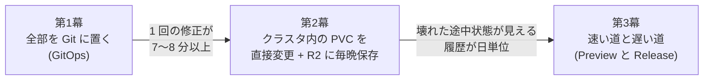

# 発表のストーリー: 内側のループと外側のループ

Cloud Native Days 学生プロポーザル向けの、発表の筋と根拠の整理。
設計の詳細は [`deep-dive-preview-release.md`](deep-dive-preview-release.md)、現状の構成は [`architecture.md`](architecture.md)、
実装中の失敗は [`dev-log.md`](dev-log.md)。

> **根拠の凡例**: ✅ 実測(この環境で測った) / 📐 設計のみ(作っていない) / 🔜 これから(実験で確かめる)
> 発表では、✅ だけを事実として話し、📐 と 🔜 はそう言う。

---

## 1. 一文で言うと

> **AI に何度も直してもらう体験では、「内側のループ(編集 → 実行 → 確認)」と「外側のループ(コミット → ビルド → デプロイ)」が
> まったく別の速度を求める。GitOps の価値は外側にあり、内側に持ち込むと遅い。
> だから、内側は可変の作業ツリー(PVC)で速く、外側は検証した不変の Release で正しく、と分けた。**

主題の問い: *誰でも AI でソフトを作れるようになったとき、それを誰が安全に動かし、何度も直し続けるのか。*
最初の利用者は母。最初のユースケースは、紙の食事予定表。

---

## 2. 3 幕の構成

### 第 1 幕: 全部を Git に置く(GitOps) — 📐 設計

- **考え方**: Agent は `kubectl` を持たず、Git に書くだけ。Argo CD が反映する。
  Agent と Kubernetes の間に Git という信頼境界を置く(plan.md)。
- **良いところ**: 変更履歴、差分、`revert`、Agent に強い権限を渡さない。
- **困ったこと**:
  - 1 つのアプリごとに、リポジトリ、CI、レジストリが要る(家庭では重い)。
  - **1 回の修正が遅い**。
- **根拠(✅ 実測。ただし代用)**: 生成アプリの GitOps は**作っていない**。代わりに、同じ仕組みで**プラットフォーム自身**を配った実測を使う。

| 区間 | 実測 | 出典 |
|---|---|---|
| コミット → image ができるまで(GitHub Actions) | **3分34秒〜4分46秒**(9 回、ほぼ 4 分) | `gh run list` |
| push → Argo CD が拾うまで | 約 3 分(既定の間隔)。この開発中も毎回待った | 作業中の観察 |
| **合計(1 回の修正)** | **7〜8 分以上** | 上の和 |

- 言い方の注意: 「作って遅かった」ではなく、**「設計して、同じ仕組みで自分の基盤を配った実測から、毎回の UI 修正には使えないと判断した」**。

### 第 2 幕: クラスタ内で完結させる(PVC を直接変更 + R2 へ毎晩保存) — ✅ 実装・実測

- **考え方**: アプリのソースはクラスタ内の PVC に置く。Agent は使い捨ての Job としてその PVC を編集する。
  実データ(Data)は別の PVC。毎晩 `restic` で R2 に暗号化して保存する(復元の練習も通した)。
- **GitOps をやめたのは「アプリのコード」だけ**。基盤(Platform、RBAC、NetworkPolicy、cloudflared、backup)は、いまも GitOps で管理している。
  → 「静的な基盤は GitOps、動的なアプリは Control Plane」(architecture.md §4)。
- **良くなったこと(✅ 実測)**: 1 回の修正は **56〜82 秒**(作成は 212 秒)。
  内訳は、Agent の実行(LLM + テスト)が約 80〜85%、Pod 起動・snapshot・本番の入れ替えが約 15〜20%。
- **困ったこと(✅ 実際に起きた)**:

| 困りごと | 何が起きたか | 出典 |
|---|---|---|
| **直す途中の壊れた状態を、家族もそのまま見る** | 天気アプリで 3 回直す間、本番がそのまま変わった | dev-log |
| **直ったかは、人が画面を見ないと分からない** | くるくるが消えない不具合は、Node のテストで見つからなかった | dev-log |
| **履歴が日単位** | 毎晩のバックアップでは、その日の中の変更は残らない(GitOps は 1 コミットごとに残る) | 設計上の事実 |
| **失敗の理由が分からない** | `BackoffLimitExceeded` だけ。原因は利用上限だった | dev-log |
| **容量が名目だけ** | 10Mi の PVC に 100MB 書き込めた(`local-path` は強制しない) | 実験 X3 |

- 言い方の注意: **R2 の保存はバックアップであって、GitOps の代わりではない**。第 2 幕で失ったもの(1 変更ごとの履歴、差分、戻す手段)を、第 3 幕で取り戻す、という筋にする。

### 第 3 幕: 速い道と遅い道 — 📐 設計 + 🔜 実験

- **要件の非対称性**: 直している途中は**すぐ**見たい。決定したあとは**時間がかかってよい**。
- **設計**: 1 つのアプリを 2 つの形で扱い、変換(昇格)を安全にする。

| | 速い道(内側のループ) | 遅い道(外側のループ) |
|---|---|---|
| 形 | 可変の作業ツリー(PVC)を、そのまま動かす | 検証した不変の成果物(Release) |
| 最適化 | **遅延**(最初の変化が見えるまで) | **正しさ・再現性・安全** |
| 工夫 | 零コピー共有、常駐の Preview、ホットリロード、優先度(PriorityClass) | 検証 Job、データの予行演習、見守り時間、Data のスナップショット |

- **GitOps の利点(履歴、戻せる、不変)を、昇格の瞬間にだけ取り戻す。**
- **深掘りの主軸: 内側のループの遅延を、実測の内訳から削る**([`deep-dive-inner-loop-latency.md`](deep-dive-inner-loop-latency.md))。
  指標は TTFC(最初の変化が見えるまで)と TTVC(検証まで)。総時間の約 8 割は LLM でインフラでは縮まらない(✅)。
  縮められるのは、LLM を待つ間に家族が見ているもの: 共有 volume とライブ Preview で、**最初の変化が中央値で約 94 s 早い(42%)、最後の変更が落ち着くまでが約 33 s 早い(23%)**
  (✅ ML1、n=10 から算出。ライブ Preview 自体は🔜)。
- **支える側: ストレージの CoW**(遅い道)。Release を作業ツリーの reflink クローン、Preview のデータを本番データのクローンにし、
  アプリごとの容量を XFS のプロジェクトクォータで強制する。**修正サイクルは速くしないが**、Release のディスクと暴走の封じ込めに効く
  ([`deep-dive-preview-release.md`](deep-dive-preview-release.md) §0)。

| 実測(✅): 遅延の内訳(変更の中央値 n=3) | 値 |
|---|---|
| 合計(家族が待つ時間)の中央値(n=10、5 種類の変更) | **159 s**(p90 214 s、範囲 76〜333 s) |
| 内訳: 書き始めるまで / 書く / 書いたあと / インフラ | 40% / 31% / 15% / **10%** |
| インフラを完璧にしたときの上限 | **約 10%**。総時間は大きく縮まない |
| ライブ Preview の効果(算出) | 最初の変化 −94 s(42%)、最後の変更が落ち着くまで −33 s(23%) |
| 書き始めるまでのばらつき | 43〜225 s(p90 103 s)。10 回に 1 回は最初の変化まで 2 分以上 |

| 実測(✅、Docker の Linux VM。実機は🔜): ストレージの CoW | 値 |
|---|---|
| 9,193 ファイル / 324 MiB の Release 作成: ext4 全コピー(今)→ XFS reflink | 1.07 s / +352.7 MiB → **0.22 s / +5.8 MiB**(約 5 倍速く、ディスク約 1/60) |
| 200 MiB のデータを別 PVC へクローン | **9 ms、追加 0 MiB**。1 MiB 書き換えると +1 MiB、本番側は無変更 |
| 10 MiB の上限で 100 MiB を書く: ext4 → XFS プロジェクトクォータ | 100 MiB 書けた → **10 MiB で失敗** |
| 今の Agent 製アプリ(依存なし、8 ファイル) | どの方式でも数 ms。**差は出ない**(正直に言う) |
- **根拠の現状**:

| 主張 | 状態 |
|---|---|
| 別の Pod が書いた変更が、読み取り専用で mount した Pod に **0.5 秒以内**に届く(`node --watch`) | ✅ 実験 X1 |
| 読み取り専用の mount には書き込めない | ✅ 実験 X2 |
| 失敗してもアプリが元に戻る、再起動後も続きから完了する | ✅ 実クラスタで検証 |
| Preview・承認・Release・Data スナップショット | 📐 設計のみ |
| 壊れた状態を家族が見る回数が、新設計で 0 になる | 🔜 E1 |
| 自動の画面確認で、利用者に見える修正の回数が減る | 🔜 E9 |
| 重い作業が裏で走っても、対話の遅延が悪化しない(PriorityClass) | 🔜 E12 |
| データを壊す変更を、予行演習で本番の前に捕まえる | 🔜 E13 |
| 作業ツリーと成果物で、動き方に差が出る頻度 | 🔜 E14 |
| reflink / クォータの実機(ワーカー)での値、LVM thin の O(1) スナップショット | 🔜 S1〜S5 |
| reflink のクローンは原子的ではなく、書き込み中の複製には途中状態が混ざりうる | 🔜 S4 |
| 母が「お試し版」を理解して使える | 🔜 E7 |

---

## 3. 発表の骨子(案: 30〜40 分)

| 時間 | 内容 |
|---|---|
| 0〜5 分 | 家の紙の食事表。母に頼まれたこと。問い: 「AI が作ったソフトを、誰が安全に動かし、直し続けるのか」 |
| 5〜10 分 | Platform の全体像(Control Plane、Agent Job、PVC、Cloudflare Tunnel + Access)。Kubernetes を使う理由 |
| 10〜15 分 | 第 1 幕: GitOps で設計 → 1 回 7〜8 分以上。「内側のループ」と「外側のループ」の言葉を出す |
| 15〜22 分 | 第 2 幕: PVC で完結 → 56〜82 秒。**天気アプリの 3 回の修正**(実話)で、困りごとを見せる |
| 22〜32 分 | 第 3 幕: 速い道 / 遅い道。PVC の工夫(零コピー、`readOnly`/`subPath`)と限界(容量を強制しない)。実験の結果 |
| 32〜37 分 | 母は使えたか(E7) |
| 37〜40 分 | まとめ: 内側は速く、外側は正しく。GitOps は外側に置く。質疑 |

**聴衆の持ち帰り**
1. 開発の「内側/外側のループ」を、AI が作るソフトの運用にも当てはめられる。
2. PVC を、信頼境界と受け渡しの道具として使う方法(`subPath` + `readOnly`)と、`local-path` の容量の落とし穴。
3. 小さな Platform でも、NetworkPolicy・PriorityClass・Job の使い分けで、速さと安全を両立できる。
4. **ストレージの CoW(reflink / スナップショット)と、容量の強制**が、「速い Preview」「安い Release」「暴走の封じ込め」を同時に解く。`local-path` の落とし穴も含めて。

---

## 4. 想定される質問と、いまの答え

| 質問 | 答え(正直に) |
|---|---|
| 「GitOps をやめたのでは?」 | アプリのコードだけ。基盤は GitOps のまま。履歴と戻す手段は昇格のときに取り戻す(設計) |
| 「なぜ Git のブランチ + Argo の Preview 環境ではダメ?」 | 1 回 7〜8 分以上かかる(✅)。内側のループには遅い。外側(昇格)には Git を使う案も残る |
| 「Agent に勝手にコードを書かせて、危なくないのか」 | Pod 単位の隔離(非 root、SA トークンなし、Source だけ mount、egress は 443 のみ)。ただし**プロンプトインジェクションの実験は未実施**(🔜) |
| 「LLM が遅いのでは。インフラで速くなるのか」 | 実測で、1 回の修正の 80% 以上は LLM。インフラの分は 15〜20%。速くなるのは**本番の入れ替え待ち**と**最初の変化が見えるまでの時間**、**修正の回数**(🔜 E8・E9) |
| 「`local-path` は本番向きではないのでは」 | その通り。容量を強制しない(✅ X3)。専用ディスク・クォータ・監視の対策案がある(🔜 E10) |
| 「単一ノードで、障害に耐えるのか」 | 耐えない。唯一の保険は R2 への毎晩のバックアップ(復元の練習は成功)。多ノード化は PV のノード固定が制約 |
| 「母は本当に使えたのか」 | **まだ測っていない**(🔜 E7)。ここが結論になるので、提出前後で最優先 |

---

## 5. 提出までにやること(優先順)

1. **E7 の準備: 母に「作るところから」使ってもらう**。結論そのものになる。記録の形式を決める(誰が・何をして・どこで迷ったか)。
2. **M0: 第 2 幕の導入前の数字**を測る(壊れた応答を家族が見た回数と時間。天気アプリの 3 回を台本にする)。
3. **M1〜M3: Preview と Release の最小実装**(本番の `releases/n` への固定、別 URL の Preview、承認)。
4. **E1(壊れた状態を見る回数)・E3(ロールバック)・E6(承認の途中障害)** を実施して、dev-log に残す。
5. 余力があれば E8・E9・E12〜E15、image 案の spike(E4)。
6. ✅ と 📐 と 🔜 の線引きを守って、スライドを作る。

**最低ライン**(提出時点で言い切れる範囲): 第 1 幕の根拠(CI と Argo の実測)、第 2 幕の実装と実測・困りごと、PVC の実験(X1〜X3)、第 3 幕の設計。
**強いライン**: 上に加えて、E1・E3・E6 の結果と、母の実使用の記録。

---

## 6. タイトル・概要の候補

- 第一候補: **「AI が書いたコードの"直し続ける"を支える — 内側のループと外側のループで分ける、自宅 Kubernetes の小さな Platform」**
- 別案: **「自宅にKubernetesを立てて、家族全員エンジニアにしてみる」**(plan.md の案)
- 技術寄り: **「AI Agent に kubectl を渡さない — PVC と Job で作る、速くて安全なアプリ生成基盤」**

**概要(下書き)**
> 家で使う紙の食事予定表を、母が自分でスマホアプリにできるようにしたい。AI がコードを書けても、それを誰が安全に動かし、何度も直し続けるのか。
> 自宅の Kubernetes に、自然言語でアプリを作る小さな Platform を作った。最初は全部を Git に置く GitOps で設計したが、1 回の修正に 7〜8 分以上かかると見積もり、
> クラスタ内の PVC で完結させた(1 回 1 分前後)。すると今度は、直す途中の壊れた状態を家族が見る問題が出た。
> そこで、編集・実行・確認の「内側のループ」は PVC 上の作業ツリーを零コピーで共有して速く、「外側のループ」は検証した不変の Release で正しく動かす設計に分けた。
> PVC の `subPath`/`readOnly` による信頼境界、`local-path` が容量を強制しないという落とし穴、そして Release と Preview のデータを CoW クローンにして容量を強制する(大きなツリーで約 5 倍速く、追加ディスクは約 1/60)といった、実際に測った結果を共有する。
