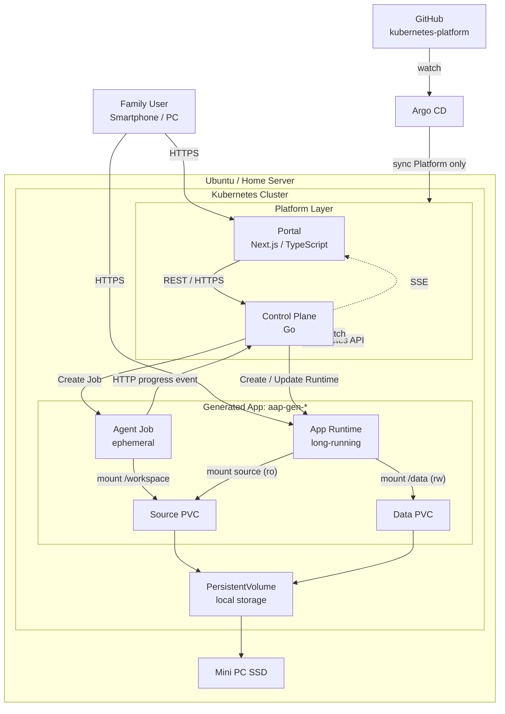
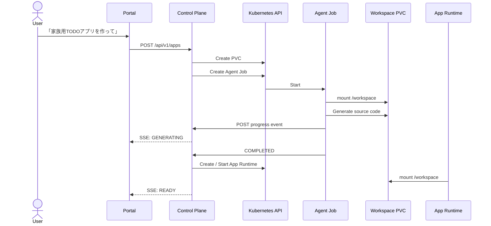
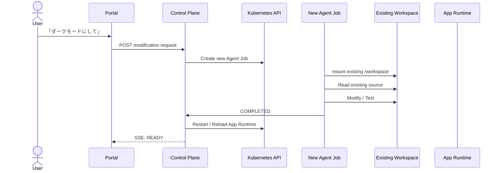
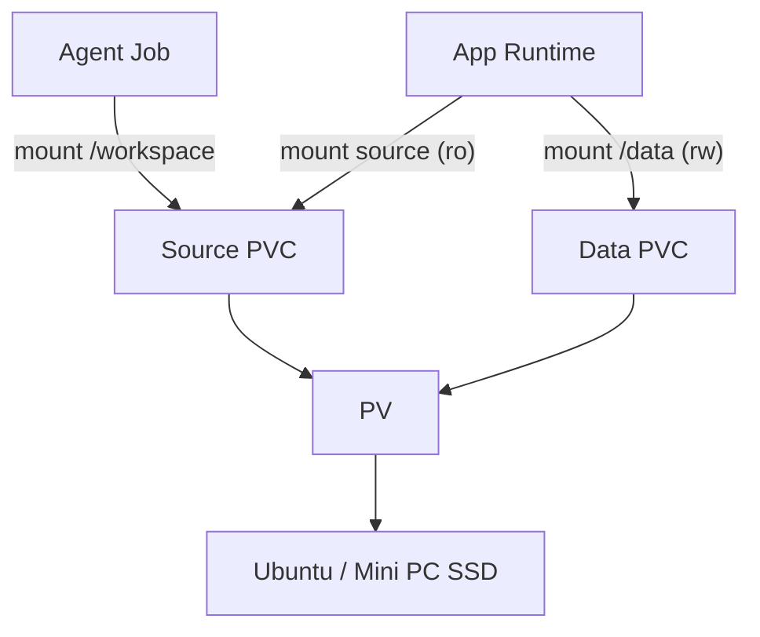
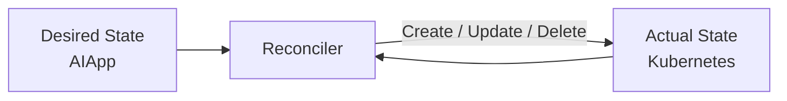

# AI App Platform Project Plan

## 1. Project Goal

自宅サーバー上の Kubernetes を使い、**ITリテラシーが高くない家族でも、スマホから「欲しいもの」を自然言語で伝えるだけで、自分たち向けの小さなアプリを作成・利用・継続的に変更できる基盤**を作る。

最初の実ユーザーは母。最初のユースケースは、現在紙で管理している「家族の昼食・夕食予定表」。

ただし、食事管理アプリそのものを作ることが目的ではない。

このプロジェクトで検証したい問いは次の通り。

> **AIによって誰でもコードを生成できるようになったとき、非エンジニアがそのソフトウェアを自分で作り、変更し、継続利用するためには、どのようなApplication Platformが必要か。**

そのために、自宅 Kubernetes 上へ小さな AI Application Platform を構築する。

---

## 2. Background

現在、母が約10日ごとに紙の表を作っている。

| 家族 | 10/4 昼 | 10/4 夜 | 10/5 昼 | 10/5 夜 | ... |
|---|---|---|---|---|---|
| 妹 | ○ | × | ○ | ○ | ... |
| 孝太郎 | × | ○ | × | ○ | ... |
| 母 | ○ | ○ | ○ | ○ | ... |
| 父 | ○ | ○ | × | ○ | ... |

現在の課題:

- 記入を忘れるため、母から「これ書いておいて」と言われる
- 家にいないと更新できない
- 予定変更を口頭やLINEで伝えることがあり、紙との間で認識齟齬が起こる
- どの状態が最新なのか分かりにくい
- 母が毎回表を準備・確認する必要がある

最初の理想状態:

- 家族全員がスマホから回答できる
- 昼 / 夜ごとに ○ / × / 未回答を管理できる
- 約10日分を一覧できる
- 予定変更をその場で反映できる
- 母が「誰が食べるか」「誰が未回答か」を簡単に確認できる

しかし本当に解決したいのは、この1アプリではない。

将来的に家族が、

- 買い物リスト
- 家族予定表
- ゴミ出し管理
- 家事当番
- 家の在庫管理

などを欲しくなったとき、毎回エンジニアである自分が設計・実装・デプロイするのではなく、家族自身が自然言語からソフトウェアを持てる状態を目指す。

---

## 3. Product Hypothesis

目指す体験は次の通り。

```text
家族
  ↓
「家族で使える買い物リストが欲しい」
  ↓
AI App Platform
  ↓
Running Application
  ↓
「写真も付けられるようにして」
  ↓
AI App Platform
  ↓
Updated Application
```

ユーザーには以下を意識させない。

- Kubernetes
- Pod / Job
- PVC
- Git
- Container Image
- CI/CD
- Ingress / Gateway

Platform がこれらを引き受ける。

---

## 4. Design Principles

### 4.1 Platform と Generated App の lifecycle を分ける

Platform 自身は長期的・静的な infrastructure であり、GitOps で管理する。

一方、Generated App はユーザー要求によって動的に生成・変更される runtime state であり、Control Plane が Kubernetes API を通じて管理する。

> **Static Platform Infrastructure = GitOps / Argo CD**
>
> **Dynamic Application Runtime = Control Plane / Kubernetes API**

### 4.2 Agent は常駐させない

AI Agent はアプリ生成・変更時のみ Kubernetes Job として起動する。

アプリ自体は長時間稼働するが、Agent は作業終了後に消す。

### 4.3 Source / Data / Image の3つを分離する

Generated App に関わる状態を、性質の異なる3つに分けて扱う。

| 種別 | 性質 | 誰が書けるか |
|---|---|---|
| Source Workspace | mutable / Agent が編集する | Agent Job（working tree のみ） |
| Application Data | persistent / Agent から隔離 | App Runtime のみ |
| Production Image | immutable / ユーザー承認済み（Stage 2） | Build Job のみ |

```text
Agent Job #1
   ↓ mount (Source のみ)
/workspace  ──→ Source PVC ──→ PersistentVolume ──→ Ubuntu / Mini PC SSD

App Runtime
   ├─ mount Source PVC (Stage 1: 実行用 / read-only)
   └─ mount Data PVC   (/data, read-write)
```

- Agent Job が終了しても source code は残る。次回変更時には新しい Agent Job が同じ Source PVC を mount する。
- Agent と Preview Runtime には、Production の Data PVC を mount しない。
- Agent は working tree の変更までを担当する。revision の確定（commit / tag 相当）や Production への promote は Agent ではなく Platform 側（finalize Job / Control Plane）の責務とする。

### 4.3.1 段階的に進める（Stage 1 / Stage 2）

最初から build / promote / migration まで設計し切らず、2段階で進める。

- **Stage 1**: `User → Control Plane → Agent → Source Workspace → App Runtime`
  Generic Runtime + Source PVC + Data PVC で end-to-end を通す。Preview / Production の区別、image build、registry はまだ導入しない。
- **Stage 2**: `Isolated Workspace → Preview → Approval → Finalize → Build → Registry → Production`
  Stage 1 の運用で得た問題を踏まえて、安全な promote を実現する。

Stage 1 を実際に使って記録した問題を、Stage 2 と Reconciliation の設計入力にする。

### 4.4 最初から高度なControllerを作らない

最初は Control Plane から Kubernetes API を命令的に呼び出して実装する。

実際の開発・障害から、

- partial failure
- retry
- idempotency
- stale state
- orphan resource
- Control Plane restart recovery

などの問題を観測する。

その問題が実際に発生した場合、Reconciliation / CRD / Controller を導入する。

---

## 5. Repository Structure

当面は **2リポジトリ** を中心に進める。

```text
k-kanke/
├── kubernetes-platform
└── ai-app-platform
```

Generated App は初期段階では GitHub repository を Source of Truth にしない。

Generated App の source code は各 App の persistent workspace に保持する。

### 5.1 `kubernetes-platform`

役割:

> **Home Kubernetes 上で Platform 自身をどう動かすかを管理する Source of Truth**

管理対象:

- Argo CD
- Portal Deployment / Service
- Control Plane Deployment / Service
- Ingress / Gateway
- RBAC
- NetworkPolicy
- StorageClass / provisioner
- monitoring / observability
- platform namespace
- cluster-level configuration

例:

```text
kubernetes-platform/
├── clusters/
│   └── homelab/
├── argocd/
└── manifests/
    ├── ai-app-platform/
    ├── gateway/
    ├── monitoring/
    └── storage/
```

Generated App ごとの Deployment / PVC / Service を Git に追加することは、初期設計では行わない。

### 5.2 `ai-app-platform`

役割:

> **自然言語からアプリを生成・変更・利用するための Application Platform 本体**

初期構成候補:

```text
ai-app-platform/
├── portal/          # Next.js / TypeScript
├── control-plane/   # Go
├── agent-runtime/   # Agent Job image / scripts
└── docs/
    └── dev-log.md
```

主な責務:

- スマホ向け Portal
- REST API
- Generated App metadata / state management
- Kubernetes API を利用した resource 作成・削除
- Agent Job 起動
- Agent progress の集約
- SSE による Portal への progress 配信
- Workspace lifecycle 管理
- Application Runtime lifecycle 管理

---

## 6. Target Architecture v1



### Boundary

Argo CD が管理するもの:

```text
Portal
Control Plane
Gateway / Ingress
RBAC
NetworkPolicy
Storage configuration
Monitoring
```

Control Plane が管理するもの:

```text
aap-gen-<app-name> Source PVC / Data PVC
Agent Job
App Runtime
Service / route
Generated App lifecycle
(Stage 2) Preview / Finalize Job / Build Job
```

---

## 7. Communication Design

| From | To | Method | Purpose |
|---|---|---|---|
| Browser | Portal | HTTPS | UI |
| Portal | Control Plane | REST / OpenAPI | App create / get / update / delete |
| Control Plane | Portal | SSE | generation / update progress |
| Control Plane | Kubernetes API | Kubernetes API | Job / PVC / Runtime / Service lifecycle |
| Kubernetes | Control Plane | Watch API | Pod / Job lifecycle changes |
| Agent Job | Control Plane | HTTP POST（Job ごとのトークン + NetworkPolicy） | Agent internal progress events（参考情報。完了判定は Job status を正とする） |
| Agent Job | Source Workspace | Volume mount | source read / write（Data は mount しない） |
| App Runtime | Source Workspace | Volume mount (ro) | generated source execution |
| App Runtime | Data PVC | Volume mount (rw) | application data (`/data`) |
| Argo CD | Kubernetes | Kubernetes API | Platform infrastructure reconciliation |

### Why REST + SSE?

Portal は Browser-facing なため、v1 では REST を採用する。

API schema は OpenAPI を Source of Truth とし、将来 CLI / Agent client が必要になった場合も client generation を可能にする。

生成処理は非同期なので、progress を polling するのではなく SSE で push する。

v1 では gRPC を導入しない。内部 service が増え、bidirectional streaming や strongly typed RPC が必要になった時点で再検討する。

---

## 8. Application Lifecycle

### 8.1 Create App



初期状態候補:

```text
QUEUED
AGENT_STARTING
GENERATING
TESTING
STARTING
READY
FAILED
```

### 8.2 Modify App



Agent は変更のたびに新しい Job として起動する。

### 8.2.1 Stage 1 の安全網

Stage 1 では稼働中の Source を Agent が直接変更するため、最低限の安全網を置く。

- Agent Job 起動前に、Platform 側の処理が Source を別の場所へ複製（tar / ディレクトリコピー）し、「直前の状態に戻す」手段にする。
- App Runtime の再起動は TESTING に成功した後だけ行う。
- Data PVC と Control Plane の SQLite を定期バックアップする（§9）。
- 最初の利用者は開発者本人か家族1人に限り、問題を記録してから母へ広げる。

### 8.3 Stage 2 の変更フロー

```text
Production → 変更要求 → isolated workspace → Agent → Preview / Test
  → User Approval → Finalize → Build → Registry → Production
```

- 変更中のコードと家族が利用中の Production を分離する。
- Preview 用 Data は、Production Data から Preview 用 Data へコピーする Job で作る（Production の Data PVC は mount しない）。
- Finalize（revision 確定）は Agent とは別の Job が行う。Build は、ユーザーが承認した revision を入力に Control Plane が専用の Build Job を起動して行う（§9.2）。

---

## 9. Workspace / Storage Design

Generated App の source code と application data を Pod filesystem に置かない。Source と Data は別の PVC にする。



v1 では home lab の local persistent storage を利用する。

PVC は「ストレージそのもの」ではなく、Kubernetes 上の storage claim。

```text
Pod -> PVC -> PV -> Ubuntu filesystem / SSD
```

Pod が消えても Source / Data は残る。ただし node / VM / physical disk 障害まで耐えるものではない。

### 9.1 Backup（Stage 1 から必須）

- Data PVC と Control Plane の SQLite PVC は、母が実運用する前に定期バックアップ（restic の cron 等）を入れる。
- Stage 1 には promote のゲートがなく、生成コードのバグで Data が壊れうるため、Stage 2 まで待たない。
- Stage 2 では promote 前の backup / snapshot を、Data lifecycle の責務としてコピー処理と合わせて整理する。

### 9.2 Source の履歴管理と revision

- Agent は working tree の変更までを行い、Git history を信頼しない。
- revision の確定（commit / tag 相当）は、Agent とは別の finalize Job の責務とする。
- Control Plane が各 App の PVC を直接 mount する構成にはしない。
- `.git` を Agent が mount できる場所に置くと履歴自体を書き換えられるため、git-dir を別 volume に分離するか、別の revision 保存方式にするかを実装時に比較する。
- Generated App を GitHub repository にすることは v1 の critical path から外す。

### 9.3 Build / Registry（Stage 2）

- Agent 自身は image build / registry push をしない。
- ユーザーが承認した revision を入力に、Control Plane が専用の Build Job を起動する。Registry credential は Build Job にのみ渡す。
- Registry（GHCR か in-cluster registry か）と build 方法（BuildKit 等）は、Stage 2 の spike で比較して決める。

### 9.4 Release と Data migration（Stage 2）

- Production Image を導入する段階で、「image + data」を1つの release として扱う設計を検討する。
- Image だけ rollback できても Data schema が非互換になれば戻せない。
- 当面は backward-compatible migration を基本ルールとし、実際に schema change が必要になった時点で backup / restore と合わせて検証する。

---

## 9A. App Contract

Agent と Platform の間の境界を、最初から最低限定義する。Agent には `AGENTS.md` 等で渡す。

| 項目 | 内容 |
|---|---|
| `/data` | persistent application data の置き場所（これ以外に永続データを書かない） |
| `PORT` | Platform から環境変数で指定される listen ポート |
| `/healthz` | health endpoint |
| 起動方法 | Platform が理解できる一定の形式（具体的な形式は Phase 0 で決める） |

Stage 2 の spike では、同じ source を Generic Runtime と build 済み image の両方で実行し、Preview / Production 間で挙動差が出ないかを確認する。

---

## 10. Generated App Naming / Ownership

Platform が生成した resource は `aap-gen-` prefix を利用する。

例:

```text
aap-gen-meal
aap-gen-shopping
aap-gen-calendar
```

Kubernetes resource には prefix だけでなく labels も付与する。

```yaml
metadata:
  labels:
    app.kubernetes.io/managed-by: ai-app-platform
    aap.dev/app-id: meal
```

人間向け識別は prefix、機械的な ownership / query は labels を利用する。

Namespace を App ごとに切るか（ResourceQuota / NetworkPolicy を Namespace 単位で適用するため）は未決。Phase 0 で Argo CD が `aap-gen-*` を prune / selfHeal しないことと合わせて確認して決める。

---

## 11. v1 Control Plane Design

最初は意図的に単純な命令型実装から始める。

```text
POST /apps
   ↓
Persist Operation (SQLite)
   ↓
Create Source PVC / Data PVC
   ↓
Create Agent Job
   ↓
Wait / Watch
   ↓
Create App Runtime
   ↓
Create Service / Route
```

ここで重要なのは、**この方式を最終設計だと仮定しないこと**。

### 11.1 State の責務分離

| 種別 | Source of Truth | 内容 |
|---|---|---|
| Platform Intent / Metadata / Operation History | Control Plane の SQLite（Control Plane 用 PVC） | App メタデータ、生成・変更リクエスト、revision、operation history |
| Runtime Actual State | Kubernetes API | Job の Running / Completed、Pod の Ready、PVC の Bound など |

- Control Plane 再起動時は、SQLite の状態をそのまま正とせず、保存済みの App / Operation と Kubernetes の Actual State を照合して復元する。
- Control Plane は `replicas: 1`、`strategy: Recreate`（RWO PVC のため、RollingUpdate は不可）。
- SQLite も backup 対象とする（§9.1）。

### 11.2 Idempotency の最小設計

- Kubernetes resource を作成する**前に** Operation を SQLite へ永続化する（write-ahead）。
- Resource 名は Operation ID から決定的に生成する。これにより、再起動後の retry で `AlreadyExists` を成功として扱える。
- Agent の完了・失敗の判定は、Agent の自己申告（progress event）ではなく Job の status を正とする。

### 11.3 記録すること

実装時に以下を記録する。

- どの Kubernetes API call が失敗したか
- 途中まで resource が作成された場合どうなったか
- 同じ request を retry するとどうなったか
- Control Plane を restart すると状態を復元できるか
- Kubernetes Actual State と Control Plane の状態がずれたか
- resource を手動削除するとどうなったか
- delete 中に failure すると orphan が残るか

SQLite の状態不整合や復旧処理の複雑さが実際に問題になれば、Reconciliation / Controller 化の判断材料にする。

---

## 12. Technical Deep Dive Candidate: Reconciliation

### Status

**第一候補。v1 ではまだ実装を前提にしない。**

実際の実装で命令型 resource management の問題を観測した後に導入を判断する。

### Expected Problems

例えば Create App が次の途中で失敗する可能性がある。

```text
Create PVC         ✓
Create Agent Job   ✓
Create App Runtime ✗
Create Service     -
```

このとき、単純な request/response model では、

- どこから retry するか
- AlreadyExists をどう扱うか
- rollback するか続きを実行するか
- Control Plane restart 後に何を信頼するか

が複雑になる。

### Possible Evolution

問題が顕在化した場合、命令列ではなく desired state を管理する。



例:

```text
Desired
PVC         exists
Runtime     exists
Service     exists
State       Running

Actual
PVC         exists
Runtime     missing
Service     exists

Reconcile
→ Runtime を再作成
```

### Possible CRD

必要性が確認できた場合のみ、以下のような CRD を検討する。

```yaml
apiVersion: platform.aap.dev/v1alpha1
kind: AIApp
metadata:
  name: meal
spec:
  state: Running
  workspace:
    size: 5Gi
  access: family
status:
  phase: Generating
  conditions:
    - type: WorkspaceReady
      status: "True"
    - type: AgentCompleted
      status: "False"
    - type: AppReady
      status: "False"
```

Controller は `AIApp` と Actual Kubernetes Resources の差分を継続的に reconcile する。

### Why this is a candidate for the talk

単に「KubernetesだからControllerを書いた」ではなく、

> 最初は Control Plane から Kubernetes API を順番に呼んでいた。しかし、partial failure / retry / restart recovery / state drift が実際に問題になった。そこで操作を成功させる設計から、desired state に収束させる設計へ変更した。

という実装経験ベースのストーリーを作る。

---

## 13. Failure Experiments

Reconciliation を導入するかどうかに関わらず、以下の failure を意図的に発生させる。

### Experiment A: Partial Creation Failure

```text
PVC       ✓
Agent Job ✓
Runtime   ✗
Service   -
```

観測:

- API response
- 残存 resource
- retry behavior
- cleanup difficulty

### Experiment B: Control Plane Restart

Application creation 中に Control Plane を kill / restart する。

観測:

- request state を復元できるか
- Agent Job は継続するか
- restart 後に completion を認識できるか

### Experiment C: State Drift

Running App の Deployment / Pod 等を手動で削除する。

観測:

- Platform が異常を認識できるか
- 自動復旧できるか
- Portal status が actual state と一致するか

### Experiment D: Duplicate Request / Retry

同じ Create / Update request を再送する。

観測:

- duplicate resource が作られるか
- AlreadyExists が発生するか
- idempotency key が必要か

### Experiment E: Delete Failure

App delete の途中で一部 API call を失敗させる。

観測:

- PVC / Service / Runtime の orphan
- source data をいつ消すべきか
- recovery / retry behavior

これらの結果を `docs/dev-log.md` に残す。

---

## 14. Development Log

技術発表の材料を後付けで作らないため、実装中の問題を継続的に記録する。

`ai-app-platform/docs/dev-log.md`:

```markdown
## YYYY-MM-DD - Problem title

### Context
何を実装していたか

### Problem
何が起きたか

### Actual State
Kubernetes上で何が残ったか

### Why
なぜ起きたと考えたか

### Temporary Fix
その時どう直したか

### Design Question
設計として何を変えるべきか

### Result
変更後どうなったか
```

特に以下のキーワードが出た問題は記録する。

```text
retry
idempotency
partial failure
recovery
state drift
orphan
race condition
concurrency
PVC
scheduling
restart
watch
```

Reconciliation より面白い問題が出た場合は、発表の Deep Dive をそちらへ変更してよい。

---

## 15. Security Boundary

Security は重要だが、現時点の発表 Deep Dive の第一候補にはしない。

最低限、Generated App / Agent を cluster-wide に信頼しない。

初期検討対象:

- dedicated ServiceAccount
- least privilege RBAC
- privileged container 禁止
- hostPath 禁止
- resource requests / limits
- NetworkPolicy
- Generated App ownership labels
- Agent Job には Source のみ mount し、Data PVC・Registry credential・cluster 権限を渡さない
- Agent → Control Plane の progress POST は Job ごとのトークンと NetworkPolicy で保護する
- LLM API key は Agent Job にだけ Secret として渡し、egress 方針を Phase 3 で決める
- Agent の Git history を信頼しない（§9.2）

また、旧 plan の「Git を Trust Boundary にする」方針から、「Control Plane の API と RBAC を Trust Boundary にする」方針へ変更している。Control Plane は特権を持つ新しい信頼対象になるため、RBAC は ownership label で絞る。「Agent に kubectl を渡す / 渡さない」「GitOps / 直接 API」の比較は、必要に応じて dev-log に結果を残す。

ただし、v1 の主目的は Security feature を網羅することではなく、Platform lifecycle を成立させ、実際の問題を観測すること。

---

## 16. Development Phases

### Phase 0: User Understanding / Foundation / Spike

目的:

> 実ユーザーの課題を理解し、Platform を継続的に開発・デプロイできる土台を作る。

ユーザー理解（コードなし）:

- 現在の紙の食事表を記録する
- Current User Journey / Pain Points / Ideal User Journey を `docs/` に書く
- Meal App の Acceptance Criteria を定義する（既存の application data が更新後も壊れないことを含む）

Foundation:

Mac で開発し、GitHub へ push する。

```text
Mac
 ↓ git push
GitHub
 ↓
Argo CD
 ↓
Ubuntu Kubernetes
```

Ubuntu への SSH は通常のアプリ開発フローでは利用しない。SSH は cluster bootstrap / node-level troubleshooting 等の break-glass 用途とする。

- Ubuntu Kubernetes 環境確認
- StorageClass / PVC の確認
- Argo CD
- platform namespace
- Portal / Control Plane の deployment skeleton
- Gateway / access path
- Argo CD が `aap-gen-*` を prune / selfHeal しないことの確認
- Namespace 戦略（App ごとか否か）の決定
- Data / Control Plane SQLite の backup 方式の決定

Spike（Stage 1 向け）:

- Generic Runtime が Source PVC を実行する方式（`npm install` の扱い、起動時間、egress）
- App Contract（§9A）の具体形式

### Phase 1: Control Plane Skeleton

作るもの:

- Go Control Plane
- REST API
- OpenAPI
- Kubernetes client
- SQLite（Operation の write-ahead 永続化）
- SSE endpoint

最小 API 候補:

```text
POST   /api/v1/apps
GET    /api/v1/apps
GET    /api/v1/apps/{id}
DELETE /api/v1/apps/{id}
GET    /api/v1/apps/{id}/events
```

この時点では Agent の高度な処理は不要。

### Phase 2: Persistent Source / Data

目的:

> Generated App の source と data を Pod lifecycle から分離し、互いに隔離する。

- Control Plane から Source PVC / Data PVC 作成
- test Job から `/workspace`（Source）mount、file write
- Job delete
- new Job から同じ Source PVC mount、file persistence 確認
- Agent Job に Data PVC が mount されないことの確認

### Phase 3: Agent Job

目的:

> 必要な時だけ Agent を起動し、Source Workspace を編集できるようにする。

- Agent Job image
- Source Workspace mount（Data は mount しない）
- `AGENTS.md` による App Contract の提供
- source generation / test
- HTTP progress event（Job ごとのトークン）
- Kubernetes Job Watch（完了判定は Job status を正とする）
- completion / failure handling
- LLM API key の Secret と egress 方針

### Phase 4: App Runtime（Stage 1 の end-to-end）

目的:

> Agent が生成した source を継続利用できる Runtime として公開する。

- Generic Runtime 起動（Source を read-only、Data PVC を `/data` に read-write で mount）
- `PORT` / `/healthz` による起動確認
- Service
- Gateway / route
- Generated App naming `aap-gen-*`
- Portal から App URL 表示
- Data PVC と Control Plane SQLite の定期 backup（家族に使わせる前に必須）

### Phase 5: Modify Existing App（Stage 1）

目的:

> 一度生成したアプリを自然言語で継続的に変更できるようにする。

```text
Existing App
 ↓
「ダークモードにして」
 ↓
Source を別の場所へ複製（直前状態の退避）
 ↓
New Agent Job
 ↓
Existing Source PVC
 ↓
Modify / Test
 ↓
TESTING 成功後に Runtime を restart
```

- 失敗時は退避した Source に戻せることを確認する。
- 最初の利用者は開発者本人か家族1人に限る。

### Phase 6: Portal UX

最低限:

```text
My Apps

🍚 ご飯管理
● Running
[開く]
[変更する]

＋ 新しいアプリ
```

生成中:

```text
アプリを作成しています

✓ Workspace prepared
✓ Agent started
● Generating
○ Testing
○ Starting
```

SSE でリアルタイム更新する。

### Phase 7: Real User Test

Acceptance Test:

> **母が、PC / SSH / GitHub / Kubernetes を意識せず、スマホから必要なアプリを作成・利用・変更できること。**

最初のユースケースとして食事予定表を作る。

Acceptance Criteria:

- 更新後も既存の application data が壊れない

観測:

- 要求を自然言語で伝えられるか
- 生成待ちの状態が理解できるか
- App と Platform の区別を意識せず使えるか
- 変更要求が自然にできるか
- failure 時に何を期待するか

### Phase 8: Stage 2 — Preview / Approval / Build / Promote

Stage 1 の運用で得た問題を踏まえて導入する。

```text
Isolated Workspace → Agent → Preview / Test → User Approval
  → Finalize → Build → Registry → Production
```

Spike:

- 同じ source を Generic Runtime と build 済み image の両方で実行し、挙動差を確認
- GHCR と in-cluster registry の比較、BuildKit 等の build 方法の比較
- git-dir 分離か別の revision 保存方式かの比較

作るもの:

- Preview 用 Data へのコピー Job
- Finalize Job（revision 確定は Agent と別）
- Build Job（承認済み revision を入力に Control Plane が起動。Registry credential は Build Job のみ）
- promote 前の Data backup / snapshot、「image + data」を1つの release として扱う rollback
- backward-compatible migration を基本ルールとして検証

### Phase 9: Failure Injection / Architecture Review

ここで意図的に failure experiments を行う（問題は各 Phase でも見つけ次第 dev-log に残す）。

結果を元に、

- 現在の命令型 Control Plane のままでよいか
- retry / idempotency の追加で十分か
- Reconciliation Loop が必要か
- CRD / Controller が必要か

を判断する。

### Phase 10: Reconciliation（必要なら）

Phase 9 で必要性が確認できた場合のみ実装する。

```text
Natural Language
      ↓
Platform API
      ↓
Desired AIApp State
      ↓
Reconciler
      ↓
PVC / Job / Runtime / Service
```

導入前後で failure recovery を比較する。

---

## 17. Talk / Technical Deep Dive Strategy

発表は二段構成にする。

### Part 1: Platform Overview

説明すること:

- 家族の実課題
- 非エンジニアが software を作るという仮説
- Kubernetes を利用する理由
- Portal / Control Plane / Agent Job / PVC / App Runtime
- Static Platform と Dynamic App の lifecycle 分離

### Part 2: One Technical Deep Dive

第一候補:

> **Dynamic Application lifecycle を壊れにくく管理するための Reconciliation 設計**

ただし、実装前にテーマを固定しない。

実装中に、

- PVC / storage
- concurrent Agent / Runtime access
- sandbox / isolation
- app startup
- Watch / event delivery
- rollback

などでより深い問題が発生した場合、その問題を Deep Dive にしてよい。

発表で重視するストーリー:

```text
最初の設計
   ↓
実際に作った
   ↓
具体的な failure / 不便が起きた
   ↓
原因を分析した
   ↓
設計を変更した
   ↓
改善を検証した
```

「最初から知っていたベストプラクティスを実装した」ではなく、**実装・失敗・観測から設計判断に至った過程**を主役にする。

---

## 18. Differentiation / Scope

このプロジェクトの中心は、単に Agent 付き Workspace / VM を提供することではない。

目指すのは、

> **非エンジニアの要求を、継続利用可能な Personal Application の lifecycle に変換する Control Plane**

である。

Agent Runtime は Platform の一部品として扱う。

将来的には、自然言語から App の desired state を表現する `AppSpec` / `AIApp` のような中間表現も検討する。

```text
User Intent
    ↓
AppSpec / AIApp
    ↓
Control Plane
    ↓
Runtime / Storage / Network
```

ただし、この abstraction も必要性を実装から確認してから導入する。

---

## 19. Non-Goals for v1

v1 では以下を目的にしない。

- Public Cloud 上での大規模 multi-tenant platform
- 完全な sandbox 実装
- 複雑な distributed storage
- 最初から CRD / Operator を作ること
- Generated App ごとの GitHub repository / CI/CD pipeline
- Stage 1 での Preview / image build / registry / promote（Stage 2 で扱う）
- gRPC を使うこと自体
- Kubernetes 技術を多く詰め込むこと

重要なのは、**小さく end-to-end を成立させ、実際の failure を観測すること**。

---

## 20. Immediate Next Steps

### Stage 1

1. 紙の食事表の記録、Current / Ideal User Journey、Meal App の Acceptance Criteria（Data が壊れないこと）を書く
2. 新しい Mini PC / Ubuntu 上の Kubernetes 環境を確認する
3. StorageClass と PVC の動作を確認する
4. Namespace 戦略、Argo CD が `aap-gen-*` を prune しないこと、backup 方式を決める
5. `kubernetes-platform` から Platform skeleton を Argo CD deploy する
6. Generic Runtime + Source PVC の spike（`npm install`、起動時間、egress）と App Contract の具体化
7. `ai-app-platform/control-plane` に Go REST API と SQLite（write-ahead Operation）を作る
8. Control Plane から Source PVC / Data PVC / test Job を作成し、Job 削除後も Source が残り、Agent から Data が見えないことを確認する
9. Agent Job → Control Plane progress event を実装する（完了判定は Job status）
10. App Runtime（Source ro + Data rw）を起動する
11. Portal から Create App → READY まで end-to-end で通す
12. 変更前の Source 退避、Data / SQLite の定期 backup を入れてから、開発者本人 → 家族1人 → 母の順に使ってもらう
13. 実装中の問題を `docs/dev-log.md` に必ず残す

### Stage 2

Stage 1 の運用結果を見てから、Phase 8 の spike（Preview と build 済み image の挙動差、registry、git-dir 分離）に着手する。

この時点では Reconciler / CRD を作らない。

まず、**どこが実際に壊れるのかを知る。**
