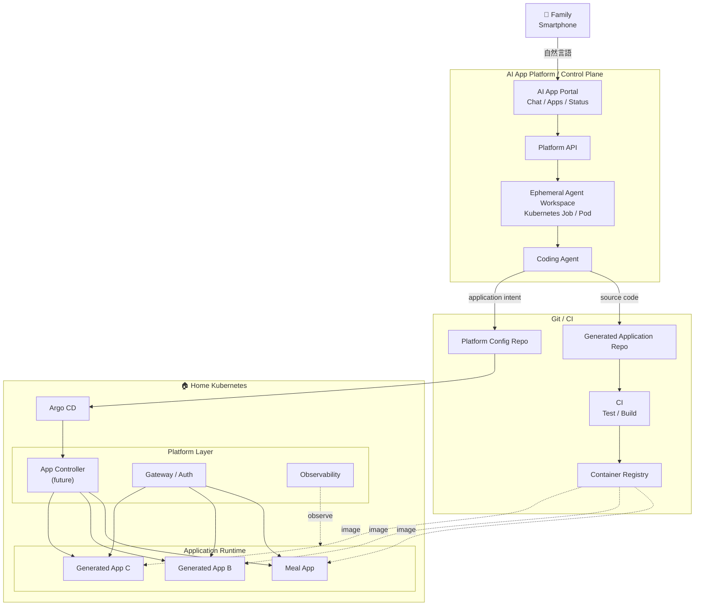
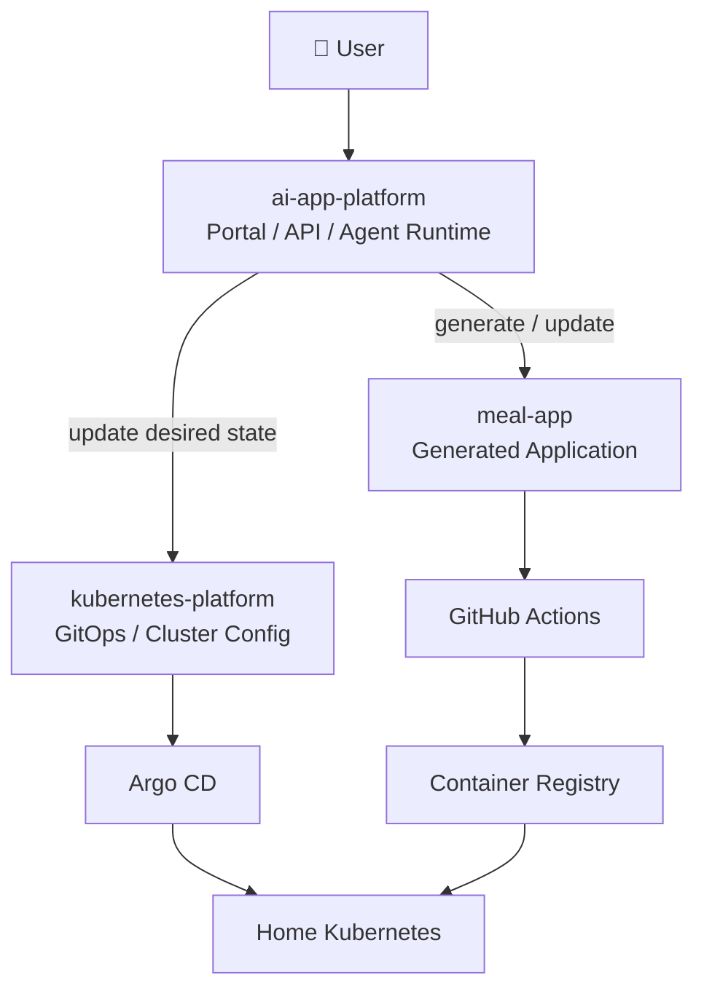

# AI App Platform Project Plan

## 1. Project Goal

自宅サーバー上の Kubernetes を使い、**ITリテラシーが高くない家族でも、スマホから「欲しいもの」を自然言語で伝えるだけで、自分たち向けの小さなアプリを作成・利用・更新できる基盤**を作る。

最初の実ユーザーは母。

最初のユースケースは、現在紙で管理している「家族の昼食・夕食予定表」。

このプロジェクトでは、単に食事管理アプリを作ることを目的にしない。

最終的には、

> 「誰でもAIでコードを生成できるようになった後、そのソフトウェアを誰が安全に実行・運用するのか？」

という問いに対して、自宅 Kubernetes 上に小さな Developer Platform を構築しながら検証する。

---

## 2. Background

現在、母が約10日ごとに紙の表を作っている。

概念的には以下のような形式。

| 家族 | 10/4 昼 | 10/4 夜 | 10/5 昼 | 10/5 夜 | ... |
|---|---|---|---|---|---|
| 妹 | ○ | × | ○ | ○ | ... |
| 孝太郎 | × | ○ | × | ○ | ... |
| 母 | ○ | ○ | ○ | ○ | ... |
| 父 | ○ | ○ | × | ○ | ... |

家族が気づいたときに紙へ ○ / × を記入する。

現在の課題:

- 記入を忘れるため、母から「これ書いておいて」と言われる
- 家にいないと更新できない
- 予定変更を口頭やLINEで伝えることがあり、紙との間で認識齟齬が起こる
- どの状態が最新なのか分かりにくい
- 母が毎回表を準備・確認する必要がある

最初の理想状態:

- 家族全員がスマホから回答できる
- 昼 / 夜ごとに ○ / × / 未回答を管理できる
- 約10日分を一覧できる
- 最後に入力された状態を Source of Truth とする
- 予定変更をその場で反映できる
- 母が「誰が食べるか」「誰が未回答か」を簡単に確認できる

---

## 3. Core Hypothesis

食事管理アプリだけを作るのであれば、Kubernetes は不要。

普通の Web アプリを1つ作れば解決できる。

しかし、本当に解決したい問題は次。

> 家族が別のアプリを欲しくなるたびに、毎回自分が設計・実装・デプロイ・運用する必要がある。

例えば将来的に、

- 買い物リスト
- 家族向け写真共有
- ゴミ出し管理
- 家族予定表
- 家事当番
- 家の在庫管理

などが欲しくなる可能性がある。

そのたびに

```text
家族
  ↓
孝太郎に頼む
  ↓
孝太郎が実装
  ↓
孝太郎がデプロイ
  ↓
孝太郎が運用
```

となるのではなく、

```text
家族
  ↓
「こういうものが欲しい」
  ↓
AI Agent
  ↓
Platform
  ↓
Application
```

にしたい。

---

## 4. Design Principle

プロジェクト全体の設計原則は以下。

> **家族には自由を与えるが、AI Agent にはインフラ上の自由を与えすぎない。**

責務を次の4層に分離する。

```text
Human
  ↓
生活上の Intent

AI Agent
  ↓
Application Intent

Home Platform
  ↓
安全な Desired State

Kubernetes
  ↓
実行
```

つまり、

- 家族は「何が欲しいか」を考える
- AI Agent は「どんなアプリが必要か」を考える
- Platform は「どう安全に動かすか」を決める
- Kubernetes は Desired State を実行する

---

## 5. Target Architecture

最終形の候補。



---

## 6. Repository Responsibilities

このプロジェクトは、最初は **3リポジトリ構成** で進める。

```text
k-kanke/
├── kubernetes-platform
├── ai-app-platform
└── meal-app
```

3つに分ける理由は、ソフトウェア本体・クラスタ基盤・生成アプリでライフサイクルと責務が大きく異なるため。

---

### 6.1 `k-kanke/kubernetes-platform`

既存の自宅 Kubernetes 基盤 repo。

役割:

> **自宅 Kubernetes クラスタ全体の Source of Truth**

ここでは「何を作るか」ではなく、**クラスタ上で各コンポーネントをどう安全に動かすか**を管理する。

主な責務:

- Argo CD
- cluster config
- monitoring
- gateway / ingress
- storage
- namespace policy
- RBAC
- NetworkPolicy
- ResourceQuota / LimitRange
- `ai-app-platform` 自体の deployment config
- generated application の desired state

想定:

```text
kubernetes-platform/
├── clusters/
│   └── homelab/
├── argocd/
├── manifests/
│   ├── monitoring/
│   ├── gateway/
│   └── ai-app-platform/
└── apps/
    ├── meal.yaml
    └── ...
```

この repo は、**Infrastructure / Cluster Platform 側**を担当する。

---

### 6.2 `k-kanke/ai-app-platform`

今回新しく作る Platform 本体。

役割:

> **非エンジニアが自然言語からアプリを生成・更新・利用するための AI Application Platform**

ここには、Platform のアプリケーションコードを置く。

初期構成:

```text
ai-app-platform/
├── portal/
├── api/
├── agent-controller/
├── agent-runtime/
└── docs/
```

将来的に必要になれば以下を追加する。

```text
ai-app-platform/
├── controller/
└── platform-api/
```

主な責務:

- スマホ向け Portal
- ユーザー要求の受付
- Agent Job の生成
- Agent 実行状態の管理
- Application creation / update workflow
- Git 操作
- Application status の集約
- 将来的な Platform API / Controller

この repo は、**Application Platform / Product 側**を担当する。

`ai-app-platform` のイメージ:

```text
User
  ↓
AI App Portal
  ↓
Platform API
  ↓
Agent Controller
  ↓
Agent Job
  ↓
Git / GitOps
```

---

### 6.3 `k-kanke/meal-app`

最初の Acceptance Test となるアプリ。

役割:

> **AI App Platform が実際に生成・更新・運用する最初の Application**

最低限の機能:

- 家族4人
- 約10日分
- 昼 / 夜
- ○ / × / 未回答
- スマホ向けUI
- 予定変更
- 最新状態の保存
- 母向け一覧表示

この repo は将来的に Agent によって生成・更新される対象。

---

### 6.4 なぜ `kubernetes-platform` と `ai-app-platform` を分けるのか

両方とも同じ Home Kubernetes 上で動くが、役割は異なる。

```text
ai-app-platform
  ├── portal
  ├── api
  ├── agent-controller
  └── agent-runtime

        ↓ CI / Build

Container Image

        ↓

kubernetes-platform
  └── manifests/ai-app-platform/
       ├── Deployment
       ├── Service
       ├── RBAC
       └── NetworkPolicy

        ↓ Argo CD

Home Kubernetes
```

責務の違い:

```text
ai-app-platform
= 何をする Platform なのか
= ユーザー要求、Agent 実行、アプリ生成ロジック

kubernetes-platform
= それをどう安全に動かすか
= Cluster config、GitOps、RBAC、Network、Storage
```

分離するメリット:

- Platform アプリケーションとクラスタ基盤の変更頻度を分けられる
- Agent に cluster-wide な設定を不用意に見せずに済む
- CI と GitOps の責務を分離できる
- `ai-app-platform` を将来別クラスタへ移しやすい
- CNDW 発表でも Platform 本体と Kubernetes 基盤を明確に説明できる
- Trust Boundary を repo 単位でも表現できる

---

### 6.5 Repository Interaction



初期段階では、この3repo構成以上には増やさない。

新しい generated app が実際に必要になった時点で、

```text
shopping-app
photo-app
...
```

のように増やすか、generated apps を monorepo 化するかを判断する。

---

## 7. Why GitOps?

最初に考えられる最も単純な構成は、

```text
Family
  ↓
Agent
  ↓
kubectl
  ↓
Kubernetes
```

しかし、この方式では Agent が Kubernetes API に直接アクセスする。

問題:

- Agent の誤操作
- 強すぎる RBAC
- Manifest の自由度が高すぎる
- 変更履歴の把握が難しい
- rollback が難しい
- Agent セッション終了後に Desired State が残らない
- Prompt Injection 等による意図しない操作の影響が大きい

そのため、

```text
Family
  ↓
Agent
  ↓
Git
  ↓
Argo CD
  ↓
Kubernetes
```

とする。

Git を

> **AI Agent と Application Runtime の Trust Boundary**

として利用する。

メリット:

- 変更履歴
- diff
- revert
- desired state の永続化
- Agent と Kubernetes API の分離
- Argo CD による reconcile

---

## 8. Why a Platform API?

最初は Agent に Deployment / Service / PVC / HTTPRoute 等を書かせることもできる。

しかし、アプリ数が増えると以下が問題になる。

- resources を書き忘れる
- securityContext が統一されない
- NetworkPolicy がバラバラ
- StorageClass の選択が不安定
- 公開方法がアプリごとに違う
- Agent prompt にインフラルールを依存する

そこで将来的に、Agent が Kubernetes primitives を直接生成するのではなく、

```yaml
apiVersion: home.example/v1
kind: AppDefinition

metadata:
  name: meal

spec:
  access: family

  resources:
    profile: small

  storage:
    enabled: true
    size: 1Gi
```

程度の **Application Intent** だけを宣言する方式を検討する。

Platform 側が以下へ変換する。

```text
AppDefinition
   ↓
Platform
   ├─ Deployment
   ├─ Service
   ├─ PVC
   ├─ NetworkPolicy
   ├─ HTTPRoute
   └─ Resource limits
```

重要なのは、

> **Agent が「何が必要か」を決め、Platform が「どう安全に実現するか」を決める**

こと。

ただし CRD / Controller は最初から作らない。

実際の運用上必要になった時点で導入する。

---

## 9. Agent Runtime vs Application Runtime

AI Agent と生成されたアプリは性質が異なる。

### Agent Runtime

- コードを書く
- shell command を実行する
- package install を行う
- 外部通信する
- CPU / Memory 使用量が一時的に大きい
- 信頼しづらい
- 作業終了後は消してよい

### Application Runtime

- 家族が日常利用する
- 安定稼働が必要
- データ保持が必要
- 長期間動作する

したがって、

```text
Agent Runtime
   ↓
Git
   ↓
Application Runtime
```

と分離する。

将来的には Agent 実行ごとに ephemeral な Kubernetes Job / Pod を作成する。

---

## 10. Generated Application Isolation

生成されたアプリ同士も基本的には信用しない。

候補:

- application ごとの Namespace
- ResourceQuota
- LimitRange
- NetworkPolicy
- restricted SecurityContext
- privileged container 禁止
- hostPath 禁止
- CPU / Memory profile
- Storage 上限

例:

```text
Home Kubernetes

platform-system
├── AI App Portal
├── Agent Runtime
├── Argo CD
└── Observability

app-meal
├── Deployment
├── Service
├── PVC
└── NetworkPolicy

app-shopping
├── Deployment
├── Service
├── PVC
└── NetworkPolicy
```

---

## 11. Access Model

Family App の公開範囲は Platform 側の概念として定義する。

候補:

```text
private
  家庭内ネットワークのみ

family
  家族認証済みユーザーのみ
  外出先からもアクセス可能

public
  Internet 公開
```

ユーザーには Kubernetes / Gateway / TLS 等を意識させない。

例えば UI 上では、

```text
誰が使いますか？

○ 家族だけ
○ 家にいるときだけ
○ 誰でも
```

程度にする。

---

## 12. Observability

Prometheus / Grafana を入れること自体を目的にしない。

家族にとって必要なのは、

```text
🍚 ご飯管理

● 正常

[開く]
```

あるいは、

```text
ご飯管理アプリが現在利用できません。
復旧処理を行っています。
```

のような状態。

したがって、

```text
Metrics / Logs / Kubernetes Events
              ↓
          Platform
              ↓
       User-facing Status
```

への変換を検討する。

エンジニア向けには Grafana 等を利用する。

---

## 13. Development Phases

### Phase 0: Current Workflow Investigation

目的:

> 実際のユーザー課題を正しく理解する。

やること:

- 現在の紙の表を記録
- 母に現在の運用を聞く
- 予定変更時にどのような認識齟齬があるか整理
- 母が本当に欲しい機能を確認
- スマホ操作で何なら自然にできるか確認

成果物:

- Current User Journey
- Pain Points
- Ideal User Journey

---

### Phase 1: Meal App を手動で作る

目的:

> Platform を作る前に、対象となる Application の実態を理解する。

作る機能:

- 10日前後の昼 / 夜
- 家族4人
- ○ / × / 未回答
- 更新
- 最新状態保存
- スマホ対応

まだ AI Agent は使わなくてよい。

---

### Phase 2: Existing Home Kubernetes へ GitOps Deploy

構成:

```text
meal-app
    ↓
GitHub Actions
    ↓
Container Registry
    ↓
kubernetes-platform
    ↓
Argo CD
    ↓
Home Kubernetes
```

この段階で、

> 1アプリ追加するために必要な作業

を全て記録する。

例:

- Namespace
- Deployment
- Service
- PVC
- Gateway / HTTPRoute
- Argo Application
- DNS
- Secret
- Resource limits

これらが Platform Requirement の材料になる。

---

### Phase 3: Application Deployment をテンプレート化

目的:

> 「新しいアプリを1つ増やす」ために必要な入力を減らす。

最初から CRD は使わない。

例えば Helm / Kustomize 等で、

```yaml
name: meal
image: ghcr.io/k-kanke/meal-app:v1
access: family
storage: 1Gi
resources: small
```

程度の入力から deployment 一式を生成できるようにする。

この時点で、

> Platform が何を標準化すべきか

を考える。

---

### Phase 4: Agent で Application Generation

目的:

> AI Agent に kubectl を与えず、Git 操作だけで application creation → deployment を完結できるか検証する。

最初は Portal 不要。

CLI 上の Codex 等で、

> 家族4人が約10日分の昼夜について、食事予定を ○ / × で登録できるスマホ向けアプリを作って

と依頼する。

Agent に許可するもの:

- source code editing
- test
- git commit / push
- platform config の更新

Agent に許可しないもの:

- kubectl
- cluster-admin
- Kubernetes API への直接 write

検証ポイント:

- GitOps だけで deploy まで到達できるか
- Agent に必要な context は何か
- AGENTS.md / Skills 等で何を与えるべきか
- Platform API が必要になる箇所はどこか

---

### Phase 5: Smartphone AI App Portal

目的:

> Terminal / SSH / GitHub を家族から完全に隠す。

最低限の UX:

```text
My Home

🍚 ご飯管理
● Running

[開く]
[変更する]

----------------

＋ 新しいものを作る
```

新規作成:

```text
何が欲しいですか？

> 昼と夜に家族が家でご飯を食べるか
> みんながスマホから入力できるようにしたい
```

Agent は必要に応じて生活上の質問をする。

例:

- 家族以外も使いますか？
- 過去の回答は残しますか？
- 誰が未回答か分かるようにしますか？

技術用語は出さない。

---

### Phase 6: Real User Test

Acceptance Test:

> **母が、孝太郎の補助なし・PCなしで、現在紙で管理している食事予定表をスマホからアプリにできること。**

検証:

1. 母がスマホから要求を入力
2. Agent と会話
3. App が生成される
4. Home Kubernetes に deploy
5. URL が表示される
6. 家族4人で利用
7. 数日運用
8. 予定変更
9. 母が追加要望を出す
10. スマホから変更
11. 更新後も既存データが壊れない

観察すること:

- どこで迷うか
- AIへの指示の仕方が分かるか
- 「アプリを作る」という発想自体が自然か
- 共有が分かりやすいか
- 状態変更を理解できるか
- エラー時に何を期待するか

---

### Phase 7: Platform API / CRD

以下の問題が実際に発生した場合のみ導入。

- Agent が Manifest を毎回違う形で生成する
- resource limit を忘れる
- NetworkPolicy が不統一
- Storage 設定が不安定
- 公開方法がバラバラ
- application onboarding が複雑

その場合、

```text
Natural Language
      ↓
AI Agent
      ↓
AppDefinition
      ↓
Controller
      ↓
Kubernetes Resources
```

へ進化させる。

---

## 14. Key Experiments

CNDW で話せるよう、結果を記録する。

### Experiment A

**Agent に kubectl を与えた場合 / 与えない場合**

比較:

- implementation speed
- reproducibility
- security
- rollback
- required permissions
- observability

---

### Experiment B

**Raw Kubernetes Manifest vs Platform abstraction**

比較:

- Agent が生成するファイル数
- configuration inconsistency
- failure rate
- required prompt length
- app onboarding steps

---

### Experiment C

**Agent Runtime と App Runtime を同居 / 分離**

比較:

- security
- resource usage
- operational complexity
- lifecycle

---

### Experiment D

**非エンジニアの実ユーザーテスト**

観測:

- 入力された自然言語
- AIとの会話回数
- 開発完了までに必要な操作
- 人間による介入回数
- 最初の要求からの仕様変更
- 使い続けてもらえるか

---

## 15. What NOT to Do Initially

以下は最初からやらない。

- CRD を作る
- Custom Controller を作る
- 複雑なマルチテナント基盤
- 完璧な認証基盤
- 独自 Agent Runtime
- 独自 LLM
- 複数ノード前提の HA
- Public Cloud への移行
- Platform を先に完成させる

理由:

> 実際の Pain を確認する前に抽象化すると、Kubernetes を使うための Platform になってしまう。

常に、

```text
User Pain
   ↓
Requirement
   ↓
Architecture
   ↓
Technology
```

の順で決める。

---

## 16. CNDW Story

発表のストーリー候補。

### 1. うちには毎日使われる「紙のシステム」がある

母が約10日ごとに食事予定表を作っている。

### 2. 母から「スマホで入力できるようにしたい」と言われた

普通なら自分が Web App を作る。

### 3. でも、それでは次も自分が作ることになる

AI がコードを書ける時代なら、家族自身が作れないか？

### 4. Agent に Kubernetes を触らせれば簡単

しかし Agent を信用してよいのか？

### 5. GitOps を Trust Boundary にした

Agent → Git → Argo CD → Kubernetes

### 6. それでも Manifest を Agent に自由に書かせたくない

Application Intent と Infrastructure implementation を分離。

### 7. 家族には自由を、Agent には制約を

Platform Engineering によって複雑さを吸収する。

### 8. 母に本当に使ってもらう

結果・失敗・改善を共有。

---

## 17. CNDW Core Message

候補:

> **AIによってコードを書くハードルは下がった。しかし、生成されたソフトウェアを安全に実行し、継続的に利用するハードルはまだ残っている。**

このプロジェクトでは、IT に詳しくない家族を実ユーザーとして、自宅 Kubernetes 上に小さな Application Platform を構築する。

そして、

> **非エンジニアに自由を与えるために、Platform 側でどこまで自由を制限すべきか**

を検証する。

---

## 18. Working Title

第一候補:

> **自宅にKubernetesを立てて、家族全員エンジニアにしてみる**

サブタイトル候補:

> **AI生成アプリを安全に動かす Home Platform の設計**

別案:

> **家族全員エンジニア化計画 — AI Agent × GitOps × Kubernetes で作る Home Platform**

技術寄り:

> **AI Agent に kubectl を渡さない — 非エンジニア向け AI Application Platform の設計**

---

## 19. Immediate Next Actions

### First

- [ ] 母の現在の紙の食事表を記録する
- [ ] Current User Journey を書く
- [ ] Pain Points を整理する
- [ ] Ideal User Journey を書く

### Second

- [ ] `meal-app` repo を作る
- [ ] 最小 Meal App を実装する
- [ ] スマホから利用可能にする

### Third

- [ ] `kubernetes-platform` に Meal App を追加
- [ ] Argo CD で GitOps deploy
- [ ] Application onboarding に必要だった全ステップを記録

### Fourth

- [ ] onboarding 手順を template 化
- [ ] Agent に必要な最小 interface を定義
- [ ] Codex から Git 経由だけで deploy できるか検証

### Fifth

- [ ] `ai-app-platform` repo を作成
- [ ] Smartphone Portal の最小版
- [ ] Agent execution API
- [ ] App status 表示

### Sixth

- [ ] 母による実ユーザーテスト
- [ ] 詰まった箇所を記録
- [ ] Platform requirement を更新

---

## 20. Success Criteria

最低ライン:

- 母が食事管理アプリをスマホで利用できる
- Meal App が Home Kubernetes 上で GitOps 管理されている
- Agent が Kubernetes API を直接操作せずに deploy できる

CNDW 発表として強いライン:

- 母自身がスマホから app creation / update を行える
- 実ユーザーテスト結果がある
- GitOps を採用した理由を実験結果から説明できる
- Agent に与える権限について比較・判断がある
- generated app isolation の設計と検証がある

理想:

- AppDefinition のような Platform API を導入
- Agent Runtime / Application Runtime を分離
- 複数の generated application を安全に運用
- 家族2人以上が実際に自分のアプリを作成する

---

## 21. Guiding Question

迷ったら常にこの問いに戻る。

> **これは母が「欲しいもの」を自分で作って使えるようにするために、本当に必要か？**

必要でなければ後回しにする。

このプロジェクトの目的は Kubernetes を複雑に使うことではなく、

> **Kubernetes / GitOps / AI Agent を使い、エンジニアリングの複雑さを非エンジニアから隠すこと**

である。
